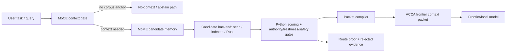
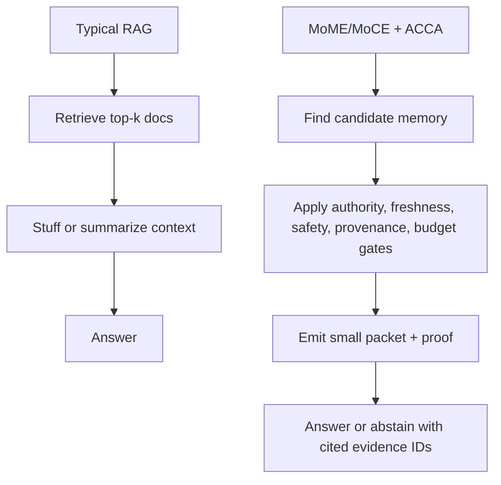
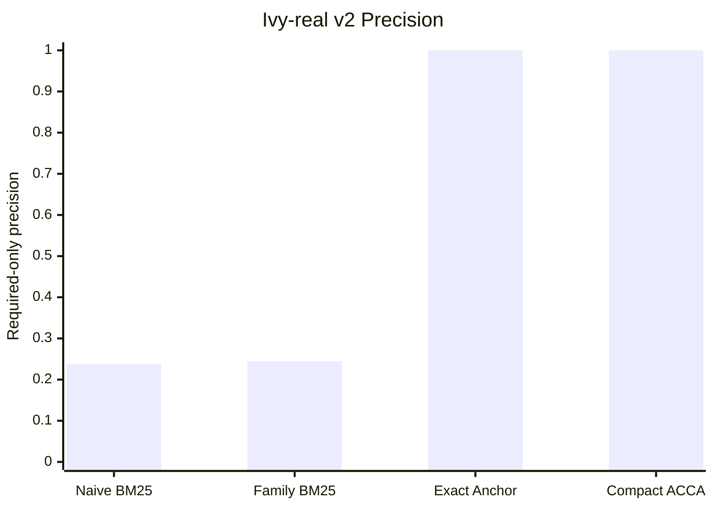
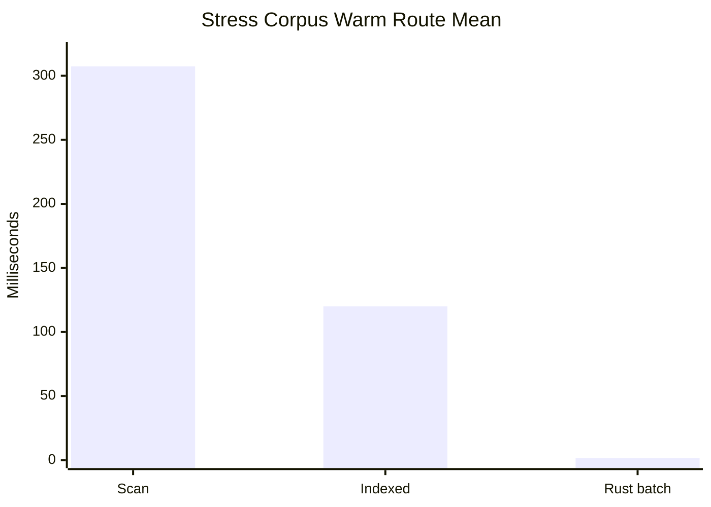

# MoME / MoCE Memory-To-Context Experiment

This directory is a local IVY experiment for building a **policy-gated memory-to-context compiler**. It is not a normal RAG app. Retrieval is only one substrate. The main goal is to turn messy stored state into a small, auditable, model-facing context packet.

The system is organized around three pieces:

- **MoME** proposes memory/evidence candidates from sparse indexes, Rust candidate search, source-family hints, and exact anchors.
- **MoCE** decides whether context is needed, filters stale/decoy/unsafe records, enforces compactness, and emits a route proof.
- **ACCA frontier packet** is the model-facing ABI: selected evidence, provenance, answerability, taint/exposure labels, and rejected-evidence summaries.



## Current Checkpoint

The latest completed work is CP9.1 plus Ivy-real v2:

- direct Rust candidate backend behind `--candidate-backend rust`;
- batch-preloaded Rust mode for benchmark/eval runs;
- Ivy-real v2 dataset generator with 45 items and 119 labeled cases;
- first-class taint/exposure metadata in route proofs and frontier packets;
- extracted `TaintExposureGate` and `PacketCompiler`;
- backend parity report runner;
- model-facing no-memory vs naive BM25 vs ACCA packet demo;
- full test pass: `pytest` 13 passed, `cargo test` ok.

## Why This Is Not Just RAG

RAG usually retrieves relevant documents and places them into a prompt. This experiment controls what a model is allowed to use as memory.



The core problem is context governance: avoid stale memory, decoys, unsafe records, private-path leakage, and overbroad prompt stuffing.

## Results

### Routing Quality

| Dataset / Mode | Cases | Passed | Required Precision | Forbidden Hits | Artifact Errors |
|---|---:|---:|---:|---:|---:|
| Ivy-real v2 indexed | 119 | 119 | 1.0 | 0 | 0 |
| Ivy-real v2 Rust batch | 119 | 119 | 1.0 | 0 | 0 |
| Stress Rust batch | 62 | 62 | 1.0 | 0 | 0 |
| Model-facing demo ACCA | 8 | 8 | 1.0 | 0 | 0 |

### Retrieval Baseline Comparison

| Mode | Cases | Passed | Required Precision | Forbidden Hits | Stale Extra | Decoy Extra |
|---|---:|---:|---:|---:|---:|---:|
| Naive BM25 top-5 | 119 | 1 | 0.2376 | 12 | 33 | 64 |
| Source-family BM25 top-5 | 119 | 8 | 0.2447 | 4 | 19 | 27 |
| Exact-anchor only | 119 | 3 | 1.0 | 0 | 0 | 0 |
| Compact ACCA | 119 | 119 | 1.0 | 0 | 0 | 0 |



### Speed

| Dataset / Backend | Upfront Preload | Warm Route Mean | Warm Route P50 | Warm Route Max |
|---|---:|---:|---:|---:|
| Ivy-real v2 indexed | 0 ms | 1.120 ms | 1.061 ms | 2.540 ms |
| Ivy-real v2 Rust batch | 59.793 ms | 0.953 ms | 0.977 ms | 1.984 ms |
| Stress scan | 0 ms | 307.263 ms | n/a | n/a |
| Stress indexed | 0 ms | about 120 ms | about 55 ms | about 486 ms |
| Stress Rust batch | 4483.781 ms | 1.694 ms | 1.859 ms | 3.744 ms |



The big win is on repeated queries against a loaded corpus: Rust batch is roughly 70x faster than Python indexed on the 2M-token stress set. The remaining gap is arbitrary one-off queries, which still need a persistent Rust daemon or library binding.

## Main Commands

Generate datasets:

```powershell
cd C:\ivy\MoME-MoCE-Exp

python scripts\generate_context_stress_dataset.py --scale smoke --seed 123
python scripts\generate_context_stress_dataset.py --scale medium --seed 123
python scripts\generate_context_stress_dataset.py --scale stress --seed 123
python scripts\generate_ivy_real_dataset.py --output out\context_stress_ivy_real --seed 777
python scripts\generate_ivy_real_v2_dataset.py --output out\context_stress_ivy_real_v2 --seed 778
```

Validate and run harnesses:

```powershell
python scripts\validate_context_stress_dataset.py --dataset out\context_stress_ivy_real_v2
python scripts\mome_moce_harness.py --dataset out\context_stress_ivy_real_v2 --candidate-backend indexed --mode deterministic
python scripts\mome_moce_harness.py --dataset out\context_stress_ivy_real_v2 --candidate-backend rust --mode deterministic
```

Compare baselines and backends:

```powershell
python scripts\run_baseline_comparison.py --dataset out\context_stress_ivy_real_v2 --top-k 5
python scripts\run_candidate_backend_comparison.py --dataset out\context_stress_ivy_real_v2 --backends indexed rust --reference indexed
python scripts\run_model_facing_demo.py --dataset out\context_stress_ivy_real_v2 --backend indexed
```

Run tests:

```powershell
python -m pytest tests -q
cargo test --manifest-path rust\acca_index\Cargo.toml
```

Generated `out/` artifacts are intentionally ignored by git. The test suite regenerates required datasets when missing.

## Main Files

| Path | Purpose |
|---|---|
| `scripts/mome_moce_harness.py` | Deterministic/hybrid MoME/MoCE router, scoring, proofs, packets |
| `scripts/routing_components.py` | Extracted taint/exposure gate and packet compiler |
| `scripts/generate_context_stress_dataset.py` | Synthetic smoke/medium/stress generator |
| `scripts/generate_ivy_real_dataset.py` | CP7 Ivy-real mini generator |
| `scripts/generate_ivy_real_v2_dataset.py` | Expanded Ivy-real v2 generator |
| `scripts/run_candidate_backend_comparison.py` | Indexed vs Rust backend parity and speed report |
| `scripts/run_model_facing_demo.py` | No-memory vs naive BM25 vs ACCA packet prompt artifacts |
| `rust/acca_index/` | Rust sparse candidate index |
| `schemas/route_proof.schema.json` | Route proof ABI |
| `schemas/frontier_context_packet.schema.json` | Frontier packet ABI |
| `docs/AUTORESEARCH_TRACK_RECORD_2026-05-10.md` | Latest track record and sidecar research notes |
| `HANDOFF_CONTEXT.md` | Short continuation context |

## Next Work

1. Build a persistent Rust index daemon or library binding so arbitrary one-off stress queries are warm without batch preload.
2. Improve raw Rust/Python candidate Jaccard while preserving selected-evidence parity.
3. Add answer-level model evals that consume only the frontier packet and cite selected evidence IDs.
4. Expand Ivy-real v3 from sanitized real run logs, failures, command history, and memory-injection traces.
5. Add observability reports for gate decisions, taint/exposure counts, token savings, and candidate drift.
