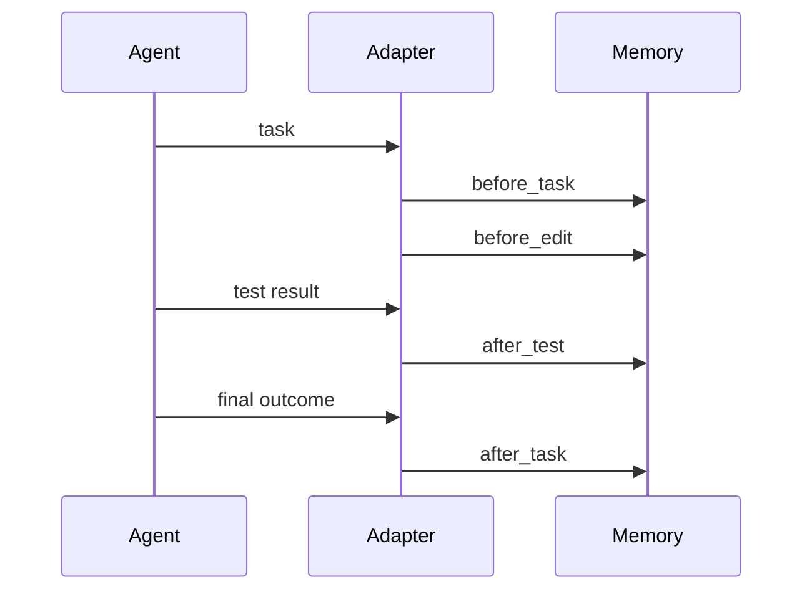

# Agent Memory Adapter Run

Generated: `2026-05-12T03:25:15Z`
OK: `True`

| Hook | Selected | Deltas |
|---|---:|---:|
| before_task | `1` | `` |
| before_edit | `1` | `` |
| after_test | `` | `1` |
| after_task | `` | `1` |

