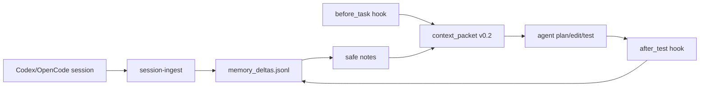

# Agent Memory Burn-In

Generated: `2026-05-12T03:05:47Z`

| Check | Value |
|---|---:|
| OK | `True` |
| Initial deltas | `4` |
| After-test deltas | `1` |
| Before-task selected | `1` |
| Packet-v2 selected | `1` |
| Total wall | `399.67 ms` |

## Meaning

The plugin can now capture a real agent session, distill it into safe durable memory, retrieve it before work, and remember verified outcomes after tests without stuffing the raw transcript into the model context.
