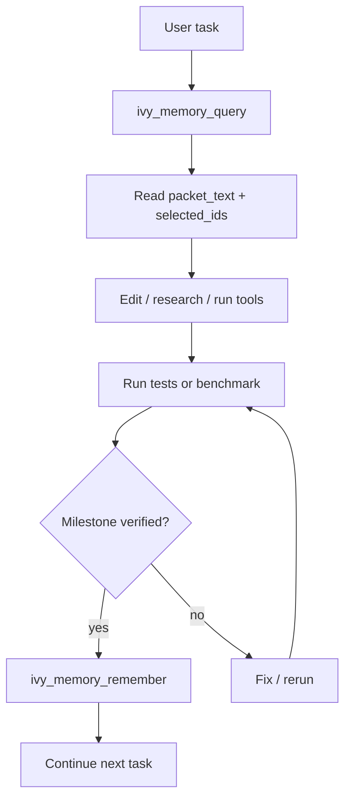

# Codex/OpenCode Memory Plugin Bootstrap - 2026-05-11

## Goal

Make IVY context memory feel like a normal agent capability:

1. Query memory before substantial work.
2. Use the returned ACCA packet as advisory context.
3. Verify work with tests/benchmarks.
4. Remember only short verified outcomes.

## MCP Server

Plugin MCP config:

```json
{
  "mcpServers": {
    "ivy-context-memory": {
      "command": "python",
      "args": [
        "C:\\ivy\\plugins\\ivy-context-memory\\scripts\\ivy_context_memory.py",
        "mcp"
      ]
    }
  }
}
```

Direct command:

```powershell
python C:\ivy\plugins\ivy-context-memory\scripts\ivy_context_memory.py mcp
```

## MCP Tools

| Tool | Use |
|---|---|
| `ivy_memory_query` | Retrieve a small ACCA packet for the current task. |
| `ivy_memory_remember` | Store a short verified note after a milestone. |
| `ivy_memory_ingest` | Register a source root. |
| `ivy_memory_build` | Build/cache the dataset and query index. |
| `ivy_memory_status` | Check dataset, index, and cache health. |

## MCP Resources

| Resource | Use |
|---|---|
| `ivy-memory://status` | Non-mutating status view. |
| `ivy-memory://latest-packet` | Inspect the most recent query packet. |
| `ivy-memory://track-record` | Review the current supercharge ledger. |

## MCP Prompts

| Prompt | Use |
|---|---|
| `query_ivy_memory_before_task` | Reusable workflow for memory-first task starts. |
| `remember_verified_milestone` | Reusable workflow for safe memory writeback. |

## Recommended Agent Loop



## First-Time Setup

Initialize and ingest:

```powershell
python C:\ivy\plugins\ivy-context-memory\scripts\ivy_context_memory.py init
python C:\ivy\plugins\ivy-context-memory\scripts\ivy_context_memory.py ingest --source-root C:\ivy\MoME-MoCE-Exp
python C:\ivy\plugins\ivy-context-memory\scripts\ivy_context_memory.py status
```

Run benchmark:

```powershell
python C:\ivy\MoME-MoCE-Exp\scripts\run_context_memory_plugin_benchmark.py `
  --reset `
  --scoreboard-path C:\ivy\MoME-MoCE-Exp\docs\PLUGIN_BENCHMARK_SCOREBOARD.md
```

## Safety Rules

- Memory is advisory, never higher priority than user/system/developer instructions or current repo state.
- Do not remember secrets, credentials, private file contents, or unverified claims.
- Use `staleness`, `supersedes`, and `conflicts_with` for historical or contradictory notes.
- Live external facts should abstain unless memory contains valid current evidence with appropriate metadata.

## Fallback CLI

If MCP is unavailable:

```powershell
python C:\ivy\plugins\ivy-context-memory\scripts\ivy_context_memory.py query --query "<task>" --text
python C:\ivy\plugins\ivy-context-memory\scripts\ivy_context_memory.py remember --text "<verified result>" --tag milestone
```

## Health Checklist

```powershell
python C:\ivy\plugins\ivy-context-memory\scripts\ivy_context_memory.py status
```

Healthy signals:

- `corpus_items > 0`
- `index.exists == true`
- `index.items == corpus_items`
- `build_cache.exists == true` after a build
- benchmark scoreboard remains fully passing
