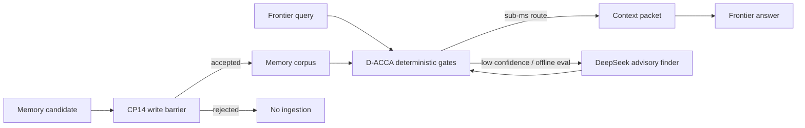

# CP10-CP14 Status - 2026-05-11

Branch: `codex/mome-cp10-cp14`

Local commits:

| CP | Commit | Result |
|---|---|---|
| CP10 | `e89544b` | Added answer-level eval; D-ACCA beats no-context and naive BM25 on final-answer quality. |
| CP11 | `fa0afa3` | Added Ivy-real v3 hard-case generator; v3 is intentionally less benchmark-y and surfaces four real misses. |
| CP12 | `3be827c` | Added deterministic latency gate; v3 passes sub-5 ms p50 target. |
| CP13 | `54c1157` | Added DeepSeek v4 Flash through codexgo as an optional DD-ACCA advisory finder plus tool/JSON eval harness. |
| CP14 | `af2b1be` | Added a memory write barrier for pre-ingestion source, safety, taint, path, and exposure checks. |

## Verification Snapshot

| Check | Result |
|---|---:|
| Contract tests | `6 passed` |
| CP10 D-ACCA answer quality | `119/119`, `1.0000` |
| CP10 naive BM25 answer quality | `55/119`, `0.4622` |
| CP10 no-context answer quality | `3/119`, `0.0252` |
| CP11/CP12 v3 deterministic quality | `120/124`, `0.9677` |
| CP12 v3 forbidden hits | `0` |
| CP12 v3 mean latency | `1.019 ms` |
| CP12 v3 p50 latency | `0.952 ms` |
| CP12 v3 worst latency | `3.063 ms` |
| CP13 DeepSeek tool/JSON eval | `16/16` |

## What Changed Technically

CP10 moved evaluation from retrieval-only success to answer-level behavior. This matters because a memory/context system should improve the final answer, not only top-k metrics.

CP11 added harder Ivy-real cases that avoid exact-anchor comfort. The current router still passes the quality gate, but the misses are useful:

- paraphrased hot-session cache rule routes to no-context;
- memory authority override can over-select validator evidence instead of policy-memory authority;
- private path memory claim can miss the intended safety-policy evidence;
- unrelated external "latest latency" can over-generalize from local IVY benchmark latency.

CP12 turns the user's latency preference into a repeatable gate. The current deterministic indexed router is comfortably below the 5 ms target on this dataset.

CP13 keeps DeepSeek out of the hot path. The tool/JSON behavior is strong enough for offline judging and rare escalation, but the latency report shows remote advisory calls are seconds-scale and should not be default routing.

CP14 starts the ingestion hardening layer. Records now need normalized relative source paths, explicit authority/staleness/safety/exposure fields, no obvious secret material in frontier text, and decoy records must be contrastive-only.

## Next Work

The next useful checkpoint is CP15: fix the four v3 misses without giving up the sub-5 ms budget. The likely approach is synonym/alias expansion for known IVY concepts, stricter out-of-domain abstention, and an authority-override rule that prioritizes safety-policy memory when the query is about whether memory can override policy.
