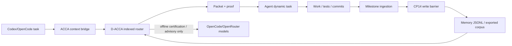

# CP15-CP20 Status - 2026-05-11

Branch: `codex/mome-cp10-cp14`

| CP | Commit | Result |
|---|---|---|
| CP15 | `5e37147` | Solved all Ivy-real v3 hard cases while keeping sub-5 ms routing. |
| CP16 | `5012db0` | Added `ivy_agent_demo.acca_context` and `ivy_agent_demo.acca_context_cli` for ACCA preview/route/self-test. |
| CP17 | `c3454fb` | Added SQLite memory to ACCA corpus exporter; live export produced 645 accepted records and 10 write-barrier rejections. |
| CP18 | `a6c0a9c` | Added optional `agent_loop.py --context-router acca --context-mode preview|inject`. |
| CP19 | `d672dfd` | Added milestone memory ingestion through CP14 write barrier. |
| CP20 | `e9bb054` | Added provider certification matrix; live DeepSeek v4 Flash certification passed 16/16 tool/JSON cases. |

## Verification Snapshot

| Check | Result |
|---|---:|
| Contract tests | `13 passed` |
| Ivy-real v3 deterministic quality | `124/124`, `1.0000` |
| Ivy-real v3 forbidden hits | `0` |
| Ivy-real v3 p50 latency | `0.820 ms` |
| Ivy-real v3 worst latency | `3.304 ms` |
| ACCA CLI self-test | `PASS` |
| Runtime memory export | `645 accepted`, `10 rejected` |
| DeepSeek v4 Flash provider cert | `certified`, `16/16` |

## Architecture Now

## Important Constraints

- ACCA context is still opt-in.
- `agent_loop.py` appends ACCA packets to the dynamic task only; the stable hot-session prefix remains byte-identical.
- Provider models are certified for advisory/eval use, not hot routing.
- Milestone/session memory is validated before persistence; unsafe rows are skipped and reported.

## Next Best Work

CP21 should test actual coding-agent outcome lift: same task with no context, legacy MoME, and ACCA injection, scored on final answer correctness, tool success, and latency. That is the next step from excellent routing metrics to real agent productivity evidence.
