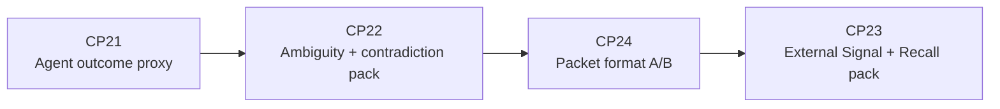
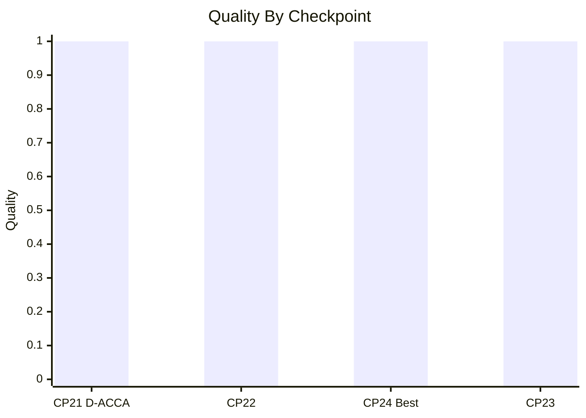
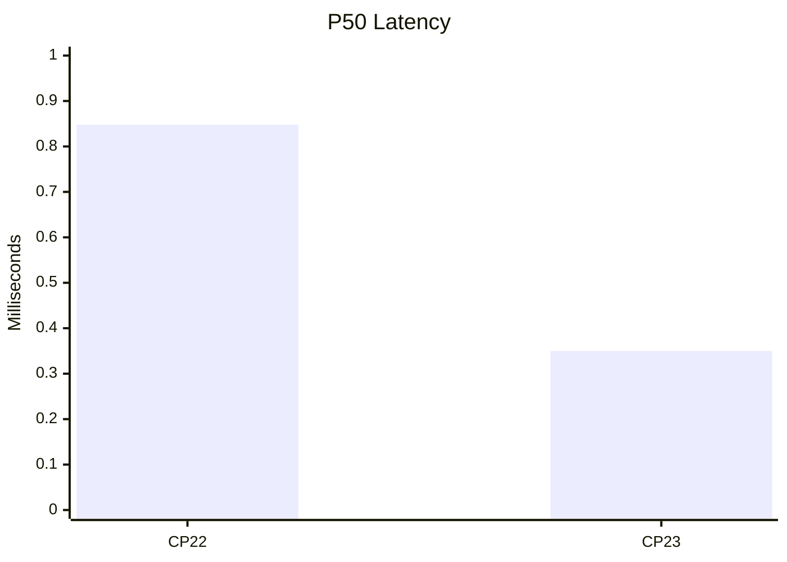

# CP21, CP22, CP24, CP23 Status - 2026-05-11

This batch moved MoME/MoCE from internal retrieval metrics toward answer usefulness, ambiguity handling, packet usability, and external generalization.

## Execution Order

The requested order was CP21, CP22, CP24, CP23.



## CP21 - Agent Outcome Eval

Added a deterministic downstream proxy in `scripts/run_agent_outcome_eval.py` with cases in `eval/agent_outcome_cases.json`.

Result on `out/context_stress_ivy_real_v3`:

| Mode | Passed | Cases | Quality | Avg Selected | Forbidden Failures |
|---|---:|---:|---:|---:|---:|
| `no_context` | 1 | 6 | 0.1667 | 0.0000 | 0 |
| `naive_bm25` | 0 | 6 | 0.0000 | 5.0000 | 3 |
| `d_acca` | 6 | 6 | 1.0000 | 1.0000 | 0 |

Interpretation: D-ACCA is not just winning retrieval IDs. In this proxy, it gives the simulated agent enough cited context to complete the task while avoiding forbidden/stale leakage.

## CP22 - Ambiguity And Contradiction

Added `scripts/generate_ambiguity_contradiction_dataset.py` and extended the router with conflict-surface handling for explicit ambiguity/contradiction requests.

Result on `out/context_stress_ambiguity_cp22`:

| Metric | Value |
|---|---:|
| Cases | 129 |
| Passed | 129 |
| Quality | 1.0000 |
| Required recall | 1.0000 |
| Required-only precision | 1.0000 |
| Forbidden hits | 0 |
| Avg selected | 1.1783 |
| Mean latency | 0.929 ms |
| P50 latency | 0.848 ms |
| Max latency | 2.787 ms |

What changed:

- Current measurements beat stale claims.
- Decoy records stay rejected unless the user is explicitly asking about false/decoy evidence.
- High-authority contradictions can be surfaced together when the question asks for conflict visibility.
- Exact anchors still do not override safety gates.

## CP24 - Packet Format A/B

Added `scripts/run_packet_format_ab.py`, a deterministic packet usability test over routed cases. It compares rendered packet shapes against required citations, abstention clarity, forbidden evidence avoidance, safety posture, conflict visibility, and rough context budget.

Result on `out/context_stress_ambiguity_cp22`:

| Variant | Passed | Cases | Quality | Conflict Pass | Avg Words |
|---|---:|---:|---:|---:|---:|
| `compact_default` | 127 | 129 | 0.9845 | 0.8750 | 74.8 |
| `answer_first` | 127 | 129 | 0.9845 | 0.8750 | 57.7 |
| `evidence_first` | 127 | 129 | 0.9845 | 0.8750 | 67.5 |
| `contradiction_aware` | 129 | 129 | 1.0000 | 1.0000 | 132.2 |
| `proof_lite` | 128 | 129 | 0.9922 | 0.9375 | 65.1 |

Winner: `contradiction_aware`.

Interpretation: the shortest packets are good for ordinary evidence injection, but they hide too much when the model needs to reason about stale, decoy, or contradictory evidence. The better default for hard cases is a contradiction-aware packet, with compact packets reserved for simple high-confidence context.

## CP23 - External Signal + Recall Generalization

Added `scripts/generate_external_signal_recall_dataset.py` and minimal router anchors for Signal/Recall vocabulary.

External source surfaces:

- `C:\tmp\signal-v01-tauri`
- `C:\Users\arahe\recall-board-excalidraw`

The dataset has 14 corpus items and 9 eval cases across:

- Signal iPhone delivery through Tailscale Serve plus Web Push.
- Signal not being a cloud service or Codex-specific system.
- Signal append-only SQLite event log as durable coordination primitive.
- Signal daemon versus worker execution boundary.
- Recall Board screenshot-free AI context export.
- Recall text graph and Graph IR.
- Recall second-brain features.
- Unsupported Recall Cloud pricing abstention.

Result on `out/context_stress_external_signal_recall`:

| Metric | Value |
|---|---:|
| Cases | 9 |
| Passed | 9 |
| Quality | 1.0000 |
| Required recall | 1.0000 |
| Required-only precision | 1.0000 |
| Forbidden hits | 0 |
| Avg selected | 0.8889 |
| Mean latency | 0.400 ms |
| P50 latency | 0.350 ms |
| Max latency | 0.856 ms |

One useful failure happened during development: the unsupported Recall Cloud pricing query initially selected a related cloud identity note. The fix was a narrow unsupported-commercial-fact gate so pricing/release questions abstain unless explicit authoritative commercial evidence exists.

## Verification

Commands run:

```powershell
.\.venv\Scripts\python.exe -m py_compile scripts\run_packet_format_ab.py
.\.venv\Scripts\python.exe scripts\run_packet_format_ab.py --output-json out\cp24_packet_format_ab.json --output-md out\cp24_packet_format_ab.md
.\.venv\Scripts\python.exe -m py_compile scripts\generate_external_signal_recall_dataset.py scripts\mome_moce_harness.py
.\.venv\Scripts\python.exe scripts\generate_external_signal_recall_dataset.py
.\.venv\Scripts\python.exe scripts\mome_moce_harness.py --dataset out\context_stress_external_signal_recall --candidate-backend indexed --output out\cp23_external_signal_recall_eval.json --no-validate-artifacts --print-failures
.\.venv\Scripts\python.exe -m pytest tests\test_cp21_cp24_cp23_contract.py -q
.\.venv\Scripts\python.exe -m pytest tests\test_cp10_cp14_contract.py tests\test_cp21_cp24_cp23_contract.py -q
```

Test result:

- `tests/test_cp21_cp24_cp23_contract.py`: 4 passed.
- `tests/test_cp10_cp14_contract.py` plus new CP tests: 17 passed.

## Current Track Record





## What This Proves

- Labels are harder than before because CP22 includes stale, contradictory, exact-anchor unsafe, and partial-evidence cases.
- Exact anchors are not allowed to trivialize safety; CP22 keeps unsafe exact-anchor records out of the selected packet.
- The system is no longer only hand-built around IVY docs; CP23 routes over Signal and Recall evidence from separate codebases.
- Ambiguous evidence is handled in two ways: select the current authoritative record when one side is stale/decoy, or surface both sides when both are current/high-authority and the query asks for conflict.
- CP21 and CP24 now test downstream answer usefulness and packet usability, not just retrieval precision.

## Next Pressure Points

- Add a live frontier-model A/B that consumes `compact_default` versus `contradiction_aware` packets and grades final answers.
- Add CP25 as an adaptive packet compiler: compact for ordinary high-confidence single-evidence cases, contradiction-aware for stale/decoy/conflict cases.
- Add CP26 as external corpus ingestion from arbitrary repos/docs instead of hand-coded external corpus items.
- Add CP27 as freshness/version proofs so unsupported commercial facts, current pricing, and release status require explicit source timestamps.
