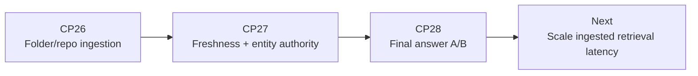

# CP26-CP28 Status - 2026-05-11

This batch adds external ingestion, freshness/version authority, and final-answer packet A/B testing.

## CP26 - External Corpus Ingester

Added `scripts/ingest_external_corpus.py`.

It scans arbitrary folders/repos, chunks docs/source files, classifies source family/staleness/safety, writes ACCA-compatible `corpus_items.jsonl`, and can generate discovered Signal/Recall smoke cases from ingested chunks.

Run against:

- `C:\tmp\signal-v01-tauri`
- `C:\Users\arahe\recall-board-excalidraw`

Result on `out/context_stress_external_ingested_cp26`:

| Metric | Value |
|---|---:|
| Corpus items | 821 |
| Cases | 6 |
| Passed | 6 |
| Quality | 1.0000 |
| Required recall | 1.0000 |
| Required-only precision | 1.0000 |
| Forbidden hits | 0 |
| Mean latency | 12.117 ms |
| P50 latency | 13.857 ms |
| Max latency | 18.104 ms |

Important lesson: auto-ingested corpora are much larger and noisier than hand-built packs. Precision still held, but latency rose from sub-ms curated packs to low double-digit ms with 821 chunks. CP29 should add an ingestion-time compact index or source-aware prefilter.

## CP27 - Freshness Authority Gate

Added `scripts/generate_freshness_authority_dataset.py` and refined the router freshness logic.

What changed:

- Current commercial/release facts are answerable only when evidence itself has matching fact type, current staleness, authority, and dated metadata.
- Related identity docs no longer satisfy pricing/release questions.
- Entity matching prevents a valid Recall Cloud price from answering a Nebula Cloud price query.
- `must_abstain` eval now accepts both `no_context_needed` and `searched_no_authoritative_evidence` when no evidence is selected.

Result on `out/context_stress_freshness_authority_cp27`:

| Metric | Value |
|---|---:|
| Cases | 3 |
| Passed | 3 |
| Quality | 1.0000 |
| Required recall | 1.0000 |
| Required-only precision | 1.0000 |
| Forbidden hits | 0 |
| Mean latency | 0.535 ms |
| P50 latency | 0.480 ms |
| Max latency | 0.813 ms |

Regression check: CP23 external Signal/Recall still passes `9/9` after this gate.

## CP28 - Final Answer A/B

Added `scripts/run_final_answer_ab.py`.

The harness renders packet variants, generates final answers with a deterministic provider by default, and scores:

- required citations
- forbidden citation avoidance
- abstention behavior
- safety language
- conflict/ambiguity language

It also has an optional OpenAI-compatible provider mode for later live DeepSeek/OpenRouter/frontier tests.

Result on `out/context_stress_ambiguity_cp22`:

| Variant | Passed | Cases | Quality | Conflict Quality | Avg Packet Words |
|---|---:|---:|---:|---:|---:|
| `compact_default` | 127 | 129 | 0.9845 | 0.9286 | 74.8 |
| `proof_lite` | 127 | 129 | 0.9845 | 0.9286 | 65.1 |
| `contradiction_aware` | 129 | 129 | 1.0000 | 1.0000 | 132.2 |

This confirms the CP24 packet result at answer level: compact packets are good for normal cases, but contradiction-aware packets are needed when the final answer must explicitly handle ambiguity, stale evidence, or rejected decoys.

## Verification

Commands run:

```powershell
.\.venv\Scripts\python.exe scripts\ingest_external_corpus.py --source-root C:\tmp\signal-v01-tauri --source-root C:\Users\arahe\recall-board-excalidraw --output out\context_stress_external_ingested_cp26 --dataset-id context_stress_external_ingested_cp26 --extension .md --extension .ts --extension .rs --seed-signal-recall-cases
.\.venv\Scripts\python.exe scripts\mome_moce_harness.py --dataset out\context_stress_external_ingested_cp26 --candidate-backend indexed --output out\cp26_external_ingested_eval.json --no-validate-artifacts --print-failures
.\.venv\Scripts\python.exe scripts\generate_freshness_authority_dataset.py
.\.venv\Scripts\python.exe scripts\mome_moce_harness.py --dataset out\context_stress_freshness_authority_cp27 --candidate-backend indexed --output out\cp27_freshness_authority_eval.json --no-validate-artifacts --print-failures
.\.venv\Scripts\python.exe scripts\mome_moce_harness.py --dataset out\context_stress_external_signal_recall --candidate-backend indexed --output out\cp23_external_signal_recall_eval.json --no-validate-artifacts --print-failures
.\.venv\Scripts\python.exe scripts\run_final_answer_ab.py --dataset out\context_stress_ambiguity_cp22 --backend indexed --output-json out\cp28_final_answer_ab.json --output-md out\cp28_final_answer_ab.md
.\.venv\Scripts\python.exe -m pytest tests\test_cp26_cp28_contract.py -q
```

Test result:

- `tests/test_cp26_cp28_contract.py`: 3 passed.



## Next

- CP29: two-stage retrieval for ingested corpora, so 800+ chunks stay under 5 ms.
- CP30: adaptive packet compiler that chooses compact/proof/contradiction-aware per query.
- CP31: live OpenRouter/DeepSeek final-answer A/B using CP28 provider mode.
