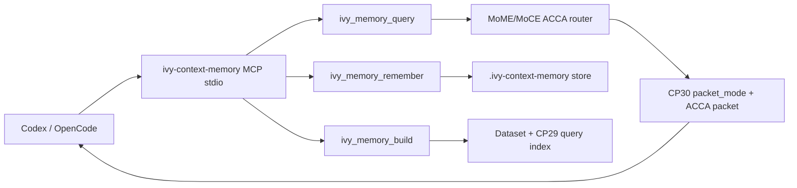

# CP33 Plugin MCP Stdio - 2026-05-11

## What Changed

The `ivy-context-memory` plugin now has a real local MCP stdio server.

Command:

```powershell
python C:\ivy\plugins\ivy-context-memory\scripts\ivy_context_memory.py mcp
```

Plugin `.mcp.json` now registers:

```json
{
  "mcpServers": {
    "ivy-context-memory": {
      "command": "python",
      "args": [
        "C:\\ivy\\plugins\\ivy-context-memory\\scripts\\ivy_context_memory.py",
        "mcp"
      ]
    }
  }
}
```

## Tools

The MCP server exposes:

- `ivy_memory_query`
- `ivy_memory_remember`
- `ivy_memory_ingest`
- `ivy_memory_build`
- `ivy_memory_status`

Tool calls return both:

- `content`: serialized JSON text for broad MCP client compatibility.
- `structuredContent`: the raw structured result for clients that support typed output.

## Transport

The server supports Content-Length framed JSON-RPC over stdio.

Implemented methods:

- `initialize`
- `tools/list`
- `tools/call`
- `notifications/*` are accepted as no-response notifications

The implementation targets the MCP `2025-06-18` schema shape for tools.

## Verification

Command:

```powershell
.\.venv\Scripts\python.exe -m pytest tests\test_ivy_context_memory_plugin.py -q
python -m py_compile C:\ivy\plugins\ivy-context-memory\scripts\ivy_context_memory.py
```

Result:

- `6 passed`
- Python compile check passed

The test launches the MCP server as a subprocess, sends framed `initialize`, `tools/list`, and `tools/call` requests, and verifies the returned tool list plus `ivy_memory_status`.

## Why This Matters

Before CP33, the plugin was useful but not truly agent-native: callers needed CLI or HTTP glue.

After CP33, Codex/OpenCode-style clients can discover and call memory tools directly:



## Current Limitation

This MCP server exposes tools only. It does not yet expose MCP resources or prompts.
