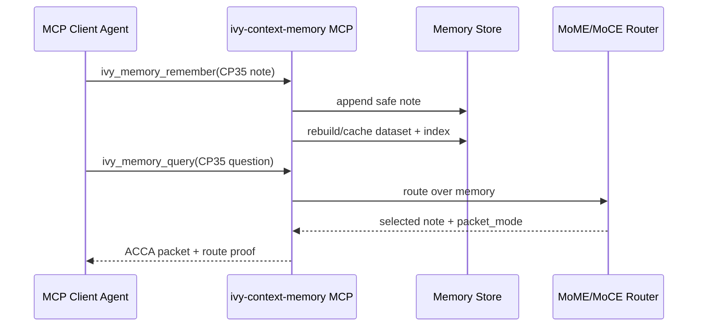

# CP35 MCP Memory Roundtrip - 2026-05-11

## What Changed

CP35 hardens the MCP integration with a full remember-query roundtrip test.

The test launches:

```powershell
python C:\ivy\plugins\ivy-context-memory\scripts\ivy_context_memory.py --store <tmp> mcp
```

Then sends Content-Length framed JSON-RPC messages for:

1. `initialize`
2. `tools/call` -> `ivy_memory_remember`
3. `tools/call` -> `ivy_memory_query`

The query must return the note as selected evidence inside a packet.

## Verification

Command:

```powershell
.\.venv\Scripts\python.exe -m pytest tests\test_ivy_context_memory_plugin.py -q
```

Result:

- `7 passed`

## Why This Matters

CP33 proved tool discovery and status calls. CP35 proves a real agent loop:



This is the minimum usable plugin contract for Codex/OpenCode integration: remember verified work, then retrieve it later through the same native tool interface.
