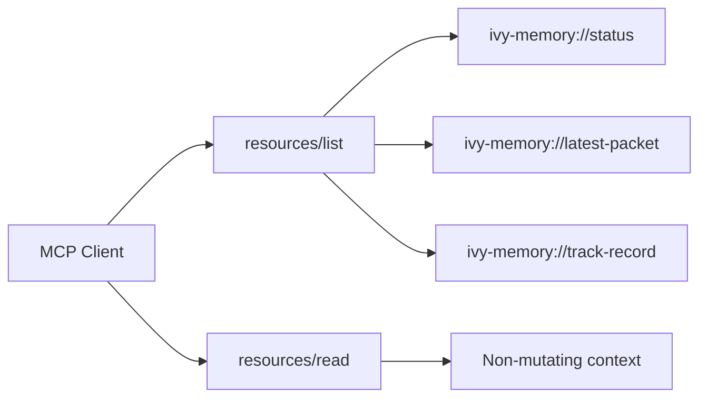

# CP38 MCP Resources - 2026-05-11

## What Changed

The `ivy-context-memory` MCP server now exposes resources in addition to tools.

Implemented MCP methods:

- `resources/list`
- `resources/read`

Resources:

| URI | MIME | Purpose |
|---|---|---|
| `ivy-memory://status` | `application/json` | Store, dataset, index, and build-cache health. |
| `ivy-memory://latest-packet` | `application/json` | Most recent packet emitted by `ivy_memory_query`. |
| `ivy-memory://track-record` | `text/markdown` | Supercharge ledger and benchmark notes. |

## Verification

The plugin MCP test now launches the server and reads:

- `ivy-memory://status`
- `ivy-memory://track-record`

Expected:

- resources are listed
- status parses as JSON with `ok: true`
- track record contains `Commit Ledger`

## Why This Matters

Tools are for actions. Resources are for context.

This lets an MCP client inspect the memory sidecar without invoking a state-changing tool:

This is a better fit for agent dashboards and context pickers than forcing every diagnostic read through `tools/call`.
