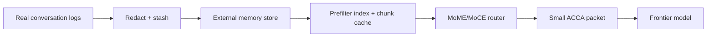

# CP45 Autoresearch Loop And 10M Context Rating - 2026-05-11

## What Changed

Added a bounded Karpathy-style autoresearch loop:

```text
MoME-MoCE-Exp/scripts/run_context_memory_autoresearch_loop.py
```

The loop:

1. Reads real local Codex conversation/session logs.
2. Redacts obvious secrets and local user path details.
3. Stashes the redacted context under ignored `out/autoresearch_loop/`.
4. Ingests the stash plus MoME/MoCE source into the IVY context-memory plugin.
5. Runs benchmark-driven policy tuning over prefilter sizes.
6. Writes the selected runtime policy to the memory store.
7. Runs the plugin benchmark.
8. Emits a 10M-token sharded-memory capacity rating.

## Real Run

Command:

```powershell
python MoME-MoCE-Exp\scripts\run_context_memory_autoresearch_loop.py `
  --reset `
  --iterations 3 `
  --max-conversation-files 10 `
  --max-records 60 `
  --target-token-rating 10000000 `
  --scoreboard-path MoME-MoCE-Exp\docs\AUTORESEARCH_LOOP_SCOREBOARD.md
```

Result:

- Redacted real-conversation records: `60`
- Redacted real-conversation tokens: `8683`
- Selected policy: `max_prefilter_items = 32`
- Policy avg router latency: `2.378 ms`
- Plugin benchmark: `6 / 6`
- Capacity target: `10,000,000`
- Projected 4096-token shards: `2442`
- Capacity rated: `true`

Scoreboard:

```text
MoME-MoCE-Exp/docs/AUTORESEARCH_LOOP_SCOREBOARD.md
```

Raw run artifacts:

```text
MoME-MoCE-Exp/out/autoresearch_loop/
```

The raw/redacted stash is intentionally under `out/` and is not committed.

## Important Caveat

This is a sharded-memory capacity rating, not a claim that a frontier model receives 10M tokens in one prompt.

The architecture is:



The 10M-token rating means the external memory side can be sharded to that scale while each query compiles only a small admissible context packet.

## Verification

Commands:

```powershell
.\.venv\Scripts\python.exe -m pytest tests\test_context_memory_autoresearch_loop.py tests\test_ivy_context_memory_plugin.py -q
python -m py_compile MoME-MoCE-Exp\scripts\run_context_memory_autoresearch_loop.py plugins\ivy-context-memory\scripts\ivy_context_memory.py
```

Result:

- `12 passed`

## Why This Matters

This creates the loop we need for continued self-improvement:

- real conversations become memory input
- memory quality is tested repeatedly
- policy is tuned based on measured quality/latency
- capacity claims are recorded with caveats
- future agents can rerun the same loop and update the scoreboard

## Next Hardening Work

- Add a larger real-conversation run after reviewing privacy boundaries.
- Add section-level quality labels for conversation-derived memories.
- Add a semantic or learned reranker candidate, keeping ACCA gates deterministic.
- Add a watcher mode that runs the loop on new sessions automatically.
- Add regression cases from failed real queries into the benchmark set.
