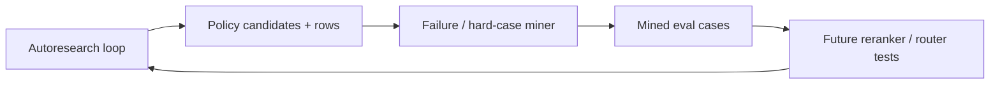

# CP46 Autoresearch Failure Miner - 2026-05-11

## What Changed

Added:

```text
MoME-MoCE-Exp/scripts/mine_autoresearch_failures.py
```

The miner reads an autoresearch loop result and extracts:

- outright failed expectations
- selection drift across prefilter depths
- packet-mode drift
- large latency sensitivity across prefilter depths

It writes:

```text
MoME-MoCE-Exp/docs/AUTORESEARCH_MINED_EVAL_CASES.json
MoME-MoCE-Exp/docs/AUTORESEARCH_MINED_FAILURES.md
```

## Real Run

Command:

```powershell
python MoME-MoCE-Exp\scripts\mine_autoresearch_failures.py `
  --result MoME-MoCE-Exp\out\autoresearch_loop\autoresearch_loop_result.json `
  --out MoME-MoCE-Exp\docs\AUTORESEARCH_MINED_EVAL_CASES.json `
  --report MoME-MoCE-Exp\docs\AUTORESEARCH_MINED_FAILURES.md
```

Result:

- mined cases: `5`

Mined hard cases:

| Query | Reason | Severity |
|---|---|---|
| CP28 final-answer packet formats | latency-sensitive to prefilter depth | medium |
| MCP tools exposed | selection changes with prefilter depth | medium |
| CP42 stale/current rebuild policy | latency-sensitive to prefilter depth | medium |
| today's Bitcoin price | latency-sensitive abstention | medium |
| real conversations ask us to build | latency-sensitive to prefilter depth | medium |

## Why This Matters

The autoresearch loop now has memory:



This is the bridge from “benchmark once” to “turn misses and unstable cases into training/eval fuel.”

## Verification

Commands:

```powershell
.\.venv\Scripts\python.exe -m pytest tests\test_autoresearch_failure_miner.py tests\test_context_memory_autoresearch_loop.py tests\test_ivy_context_memory_plugin.py -q
python -m py_compile MoME-MoCE-Exp\scripts\mine_autoresearch_failures.py
```

Result:

- `13 passed`

## Next

CP47 should consume `AUTORESEARCH_MINED_EVAL_CASES.json` and score candidate reranking policies against those mined hard cases.
