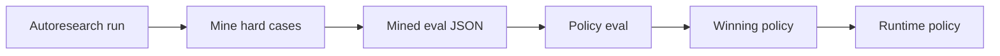

# CP47 Mined Case Policy Eval - 2026-05-11

## What Changed

Added:

```text
MoME-MoCE-Exp/scripts/run_mined_case_policy_eval.py
```

This consumes:

```text
MoME-MoCE-Exp/docs/AUTORESEARCH_MINED_EVAL_CASES.json
```

and evaluates prefilter policies against the mined hard cases.

## Important Fix

The first CP47 run exposed a useful lesson: mined cases cannot rely only on exact selected source IDs because the memory store can later select a better equivalent note.

Example:

- mined CP28 expected an older doc chunk ID
- the current store selected the cleaner explicit CP28 note
- exact-ID scoring marked it as failed even though it was semantically better

Fix:

- mined cases now include `expected_terms` for known semantic anchors
- policy eval passes when required IDs match or all expected terms appear in the returned packet

## Real Run

Command:

```powershell
python MoME-MoCE-Exp\scripts\run_mined_case_policy_eval.py `
  --store MoME-MoCE-Exp\out\autoresearch_loop\memory_store `
  --cases MoME-MoCE-Exp\docs\AUTORESEARCH_MINED_EVAL_CASES.json `
  --out MoME-MoCE-Exp\docs\AUTORESEARCH_MINED_POLICY_EVAL.md
```

Result:

- winner: `max_prefilter_items = 32`
- passed: `5 / 5`
- avg wall: `46.207 ms`
- avg router latency: `2.534 ms`

Output:

```text
MoME-MoCE-Exp/docs/AUTORESEARCH_MINED_POLICY_EVAL.md
```

## Verification

Commands:

```powershell
.\.venv\Scripts\python.exe -m pytest tests\test_mined_case_policy_eval.py tests\test_autoresearch_failure_miner.py -q
python -m py_compile MoME-MoCE-Exp\scripts\mine_autoresearch_failures.py MoME-MoCE-Exp\scripts\run_mined_case_policy_eval.py
```

Result:

- `2 passed`

## Why This Matters

CP46 mines hard cases. CP47 closes the loop by scoring candidate policies against them.

That gives the autoresearch loop a practical learning cycle:



CP48 should start adding deterministic reranker feature candidates beyond just `max_prefilter_items`.
