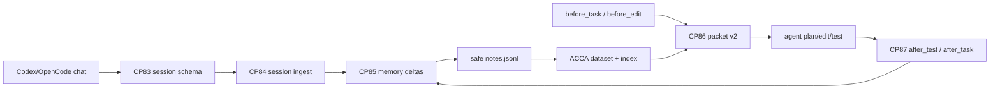

# CP83-CP92 Agent Memory Integration - 2026-05-12

This batch moves `ivy-context-memory` from a query/remember sidecar into something Codex, OpenCode, or any MCP-capable coding agent can use as an external conversation memory loop.

The important change is not bigger prompts. The plugin now captures agent sessions, distills them into safe memory deltas, retrieves compact packets before work, and records verified outcomes after tests.



## Checkpoints

| CP | Result | Verification |
|---|---|---|
| CP83 | Added `agent_session v0.1` normalization for Codex/OpenCode-style records/messages/events. | `test_session_ingest_derives_deltas_and_redacts_secret_text` |
| CP84 | Added session ingest surfaces: CLI `session-ingest`, HTTP `/session/ingest`, MCP `ivy_memory_session_ingest`. | MCP roundtrip test |
| CP85 | Added `memory_deltas.jsonl` and automatic durable delta extraction for decisions, failures, test results, outcomes, preferences, and commands. | Plugin session-ingest test |
| CP86 | Added `context_packet v0.2` wrapper with policy, selected IDs, route proof, answerability, timings, and packet path. | Agent hook packet test |
| CP87 | Added agent hook contract: `before_task`, `before_edit`, `after_test`, `after_task`, `remember`, `supersede`. | CLI/HTTP/MCP-callable code paths and tests |
| CP88 | Added explicit memory policy: instructions and current repo state outrank memory; memory is advisory; secrets are rejected/redacted. | MCP policy precedence test |
| CP89 | Added daemon-ready HTTP endpoints `/agent/hook` and `/packet/v2` for persistent sidecar use. | Daemon smoke now checks both endpoint summaries |
| CP90 | Added a real repo loop path: session -> deltas -> notes -> ACCA build -> before-task retrieval. | CP92 burn-in script |
| CP91 | Updated plugin README/skill UX around session ingest, hooks, and packet v2. | Documentation checkpoint |
| CP92 | Added a reproducible burn-in and capped proof-router candidate scoring at `16` while keeping the recall prefilter at `32`. | `scripts/run_agent_memory_burn_in.py --reset`; daemon smoke |

## API Shape

CLI:

```powershell
python C:\ivy\plugins\ivy-context-memory\scripts\ivy_context_memory.py session-ingest --json session.json
python C:\ivy\plugins\ivy-context-memory\scripts\ivy_context_memory.py agent-hook --hook before_task --task "What context matters?"
python C:\ivy\plugins\ivy-context-memory\scripts\ivy_context_memory.py packet-v2 --query "What changed in CP83-CP92?"
```

HTTP:

```powershell
Invoke-RestMethod http://127.0.0.1:8768/session/ingest -Method Post -ContentType application/json -Body $json
Invoke-RestMethod http://127.0.0.1:8768/agent/hook -Method Post -ContentType application/json -Body '{"hook":"before_task","task":"What matters now?"}'
Invoke-RestMethod http://127.0.0.1:8768/packet/v2 -Method Post -ContentType application/json -Body '{"query":"What changed in CP83-CP92?"}'
```

MCP tools:

- `ivy_memory_session_ingest`
- `ivy_memory_agent_hook`
- existing `ivy_memory_query`, `ivy_memory_remember`, `ivy_memory_ingest`, `ivy_memory_build`, `ivy_memory_warm`, `ivy_memory_status`

## Burn-In Result

Latest local burn-in:

| Metric | Value |
|---|---:|
| Initial deltas | `4` |
| After-test deltas | `1` |
| Before-task selected | `1` |
| Packet-v2 selected | `1` |
| Total wall | `399.67 ms` |

The wall time includes repeated safe-note rebuilds in the cold one-shot script. The hot daemon path remains the intended low-latency path for live agent sessions.

The daemon smoke originally selected the right evidence through `/agent/hook` and `/packet/v2`, but the full-source router path scored all `32` prefiltered candidates and missed the old `5 ms` router budget at `6.136 ms`. CP92 now keeps the `32` recall prefilter while capping the final proof router at `16` candidates by default. The live daemon rerun passed: query wall `11.889 ms`, router `4.406 ms`, `/agent/hook` selected CP30 evidence, and `/packet/v2` selected the plugin MCP evidence.

## Verification

```powershell
python -m py_compile plugins\ivy-context-memory\scripts\ivy_context_memory.py MoME-MoCE-Exp\scripts\run_agent_memory_burn_in.py MoME-MoCE-Exp\scripts\run_context_memory_daemon_smoke.py
.\.venv\Scripts\python.exe -m pytest tests\test_ivy_context_memory_plugin.py tests\test_agent_memory_burn_in.py tests\test_context_memory_daemon_smoke.py -q
.\.venv\Scripts\python.exe scripts\run_context_memory_daemon_smoke.py --store out\daemon_smoke_cp83_cp92 --out docs\DAEMON_SMOKE_TEST.md
.\.venv\Scripts\python.exe scripts\run_context_memory_regression_gate.py
```

## Why This Matters

Before this batch, agents could query and remember facts, but they had to decide manually what to save. After this batch, the plugin has a minimal lifecycle:

1. capture real conversation/tool/test events,
2. redact obvious secrets,
3. distill only durable deltas,
4. retrieve compact packets before future work,
5. record verified outcomes after tests.

That is closer to an actual context/memory system for long coding sessions than a plain RAG store.
