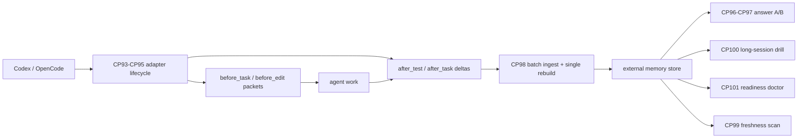

# CP93-CP102 Agent Memory Usage - 2026-05-12

This batch turns the CP83-CP92 lifecycle primitives into a usable agent workflow and proves the system helps at the answer/task level, not only at retrieval.



## Checkpoints

| CP | Result | Verification |
|---|---|---|
| CP93 | Added `run_agent_memory_adapter.py`, a minimal Codex/OpenCode adapter that runs the memory lifecycle around a task. | Adapter run selected memory before task/edit. |
| CP94 | Verified hook sequencing: `before_task`, `before_edit`, `after_test`, `after_task`. | `test_cp93_cp95_adapter_lifecycle` |
| CP95 | Added adapter contract report with a sequence diagram and readiness check. | `AGENT_MEMORY_ADAPTER_RUN.md` |
| CP96 | Added answer-quality A/B: no memory versus packet-v2 memory. | `run_agent_memory_answer_ab.py --reset` |
| CP97 | A/B result: no-memory quality `0.0`, packet-v2 memory quality `1.0` on three agent-memory cases. | `AGENT_MEMORY_ANSWER_AB.md` |
| CP98 | Added batch session ingest across Python, CLI, HTTP, and MCP, with one final rebuild instead of rebuild-per-delta. | Batch ingest unit and MCP tests |
| CP99 | Added freshness scan for registered source roots modified after last build. | Freshness unit test |
| CP100 | Added long-session drill: `1000` raw records, `16990` token estimate, `3` durable deltas, selected evidence in `3.179 ms`. | `AGENT_MEMORY_LONG_SESSION_DRILL.md` |
| CP101 | Added agent memory doctor/readiness checks for dataset, index, hooks, MCP lifecycle tools, and write barrier. | Doctor unit and MCP tests |
| CP102 | Refreshed docs, scoreboard, daemon smoke, and regression gate. | 28 focused tests, daemon smoke, combined regression gate |

## Results

| Surface | Result |
|---|---:|
| Focused tests | `28 passed` |
| Adapter lifecycle | `ok`, `247.77 ms` |
| Answer A/B no-memory | `0 / 3`, quality `0.0` |
| Answer A/B packet-v2 memory | `3 / 3`, quality `1.0` |
| Long-session drill | `1000` records -> `3` durable deltas |
| Long-session packet wall | `3.179 ms` |
| Daemon query wall | `10.142 ms` |
| Daemon router | `4.638 ms` |
| Regression gate | `passed` |

## Why This Matters

CP83-CP92 proved the memory lifecycle exists. CP93-CP102 proves the lifecycle is usable:

1. An adapter can call memory automatically instead of relying on a human to remember query commands.
2. Answer-quality improves in a controlled no-memory versus memory comparison.
3. Batch ingest removes the obvious rebuild bottleneck for real conversations.
4. Freshness and doctor checks make the sidecar safer to use in long-running sessions.
5. Long raw sessions can stay outside the model while durable deltas remain compact and retrievable.

## Commands

```powershell
python MoME-MoCE-Exp\scripts\run_agent_memory_adapter.py --reset
python MoME-MoCE-Exp\scripts\run_agent_memory_answer_ab.py --reset
python MoME-MoCE-Exp\scripts\run_agent_memory_long_session_drill.py --reset --records 1000
python plugins\ivy-context-memory\scripts\ivy_context_memory.py agent-doctor
python plugins\ivy-context-memory\scripts\ivy_context_memory.py freshness-scan
```

## Verification

```powershell
python -m py_compile plugins\ivy-context-memory\scripts\ivy_context_memory.py MoME-MoCE-Exp\scripts\run_agent_memory_adapter.py MoME-MoCE-Exp\scripts\run_agent_memory_answer_ab.py MoME-MoCE-Exp\scripts\run_agent_memory_long_session_drill.py
.\.venv\Scripts\python.exe -m pytest tests\test_ivy_context_memory_plugin.py tests\test_agent_memory_burn_in.py tests\test_agent_memory_cp93_cp102.py tests\test_context_memory_daemon_smoke.py -q
.\.venv\Scripts\python.exe scripts\run_context_memory_daemon_smoke.py --store out\daemon_smoke_cp93_cp102 --out docs\DAEMON_SMOKE_TEST.md
.\.venv\Scripts\python.exe scripts\run_context_memory_regression_gate.py
```
