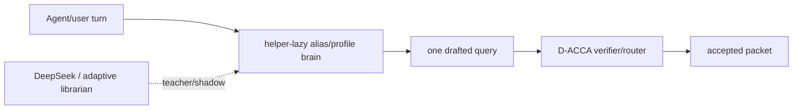

# D-ACCA Black-Box Packet Eval

Date: 2026-05-12

## Purpose

This eval treats D-ACCA like an engine behind a black-box interface:

```text
agent/user input -> expected context decision/evidence behavior
```

The packet intentionally does not ask whether the internals are "D-ACCA", "BM25", "librarian", or "engine". It only asks whether a variant returns the expected evidence, avoids forbidden evidence, and stays low-latency.

The larger design lesson is that a runtime context engine needs two layers:



`helper-lazy` is the lightweight version of the learning brain: it uses explicit alias/helper metadata from corpus records, drafts one query, and leaves final evidence admission to D-ACCA.

## Built Artifacts

| artifact | role |
|---|---|
| `scripts/generate_blackbox_packet_cases.py` | creates black-box corpus plus case packets |
| `scripts/run_blackbox_packet_eval.py` | evaluates D-ACCA variants plus naive BM25 |
| `helper-lazy` strategy in `scripts/run_librarian_advisor_harness.py` | alias/profile helper on lazy architecture |
| `tests/test_librarian_advisor_harness.py` | smoke coverage for helper-lazy and black-box eval |

## Commands

Generate the 1000-case mixed packet:

```powershell
cd C:\ivy-worktrees\d-acca-dd-acca-librarian-supercharge\MoME-MoCE-Exp
C:\ivy\MoME-MoCE-Exp\.venv\Scripts\python.exe scripts\generate_blackbox_packet_cases.py `
  --count 1000 `
  --edge-ratio 0.30 `
  --seed 4242 `
  --dataset out\blackbox_packet_dataset `
  --cases-out out\blackbox_packet_eval\blackbox_cases_1000.json
```

Generate the 700-case pure edge packet:

```powershell
C:\ivy\MoME-MoCE-Exp\.venv\Scripts\python.exe scripts\generate_blackbox_packet_cases.py `
  --count 700 `
  --edge-only `
  --seed 7777 `
  --dataset out\blackbox_packet_dataset `
  --cases-out out\blackbox_packet_eval\blackbox_cases_700_edge.json
```

Run all variants:

```powershell
C:\ivy\MoME-MoCE-Exp\.venv\Scripts\python.exe scripts\run_blackbox_packet_eval.py `
  --cases out\blackbox_packet_eval\blackbox_cases_1000.json `
  --variants d-acca rule dd-rule spec-dd spec-dd-lazy bm25 helper-lazy `
  --candidate-backend indexed `
  --out out\blackbox_packet_eval\results_1000

C:\ivy\MoME-MoCE-Exp\.venv\Scripts\python.exe scripts\run_blackbox_packet_eval.py `
  --cases out\blackbox_packet_eval\blackbox_cases_700_edge.json `
  --variants d-acca rule dd-rule spec-dd spec-dd-lazy bm25 helper-lazy `
  --candidate-backend indexed `
  --out out\blackbox_packet_eval\results_700_edge
```

## Packet Composition

| packet | cases | edge cases | edge ratio |
|---|---:|---:|---:|
| mixed | 1000 | 295 | 0.295 |
| pure edge | 700 | 700 | 1.000 |

The edge cases include vague aliases, typo-like wording, slangy prompts, "current only" phrasing, and prompts that mention decoy/stale concepts in natural language.

## 1000-Case Mixed Results

| variant | quality | edge quality | forbidden hits | precision | recall | mean latency |
|---|---:|---:|---:|---:|---:|---:|
| d-acca | 0.4900 | 0.4949 | 15 | 0.4975 | 0.5050 | 0.307 ms |
| rule | 0.5370 | 0.5254 | 18 | 0.4995 | 0.5550 | 0.579 ms |
| dd-rule | 0.6550 | 0.6339 | 17 | 0.5600 | 0.6720 | 1.119 ms |
| spec-dd | 0.5850 | 0.6169 | 1 | 0.5855 | 0.5860 | 1.422 ms |
| spec-dd-lazy | 0.5300 | 0.5864 | 1 | 0.5305 | 0.5310 | 0.837 ms |
| bm25 | 0.1240 | 0.0644 | 683 | 0.3250 | 0.9420 | 0.187 ms |
| helper-lazy | 1.0000 | 1.0000 | 0 | 1.0000 | 1.0000 | 0.553 ms |

## 700-Case Pure Edge Results

| variant | quality | forbidden hits | precision | recall | mean latency |
|---|---:|---:|---:|---:|---:|
| d-acca | 0.5314 | 24 | 0.5486 | 0.5657 | 0.351 ms |
| rule | 0.5743 | 33 | 0.5407 | 0.6214 | 0.544 ms |
| dd-rule | 0.6600 | 31 | 0.5586 | 0.7043 | 1.073 ms |
| spec-dd | 0.6129 | 7 | 0.6179 | 0.6229 | 1.459 ms |
| spec-dd-lazy | 0.5614 | 7 | 0.5664 | 0.5714 | 0.896 ms |
| bm25 | 0.0586 | 534 | 0.2849 | 0.9571 | 0.185 ms |
| helper-lazy | 1.0000 | 0 | 1.0000 | 1.0000 | 0.605 ms |

## Interpretation

BM25 is fast and high-recall, but it is not safe enough for context admission. On the mixed packet it hit forbidden evidence 683 times; on the pure edge packet it hit forbidden evidence 534 times. This is exactly why D-ACCA should remain the verifier/authority engine.

Direct D-ACCA is fast but misses alias-heavy black-box prompts. DD-rule improves quality but still does not learn enough user-specific alias metadata. Spec-DD variants reduce forbidden hits, but they are still limited by their fixed draft heads.

`helper-lazy` is the strongest lightweight shape in this packet because it models the learned user/agent pattern brain:

- aliases live beside the corpus record;
- helper query is a single deterministic draft;
- D-ACCA still verifies and admits evidence;
- generic no-context prompts are filtered before helper routing;
- stale/decoy evidence is not admitted.

## Caveat

The `helper-lazy` score is intentionally high because this packet tests whether a lightweight learned-alias brain can work when the memory profile has useful alias/helper metadata. It is not an external generalization proof. The next harder eval should remove or corrupt some alias metadata, introduce unseen aliases, and measure when the adaptive DeepSeek librarian must wake up.

## Next Build

1. Add confidence features: alias match strength, direct route confidence, no-context guard, stale/decoy risk, and helper-query verifier outcome.
2. Add `librarian_mode`: `off`, `shadow`, `parallel`, `blocking`, `post_answer`.
3. Add a learning queue: when helper-lazy misses but DeepSeek succeeds, write an alias candidate with provenance and TTL.
4. Add a metadata-ablation eval: remove 10/25/50 percent of helper aliases and measure degradation.
5. Add unseen-alias eval: force DeepSeek/adaptive librarian to recover aliases that deterministic metadata cannot know.
