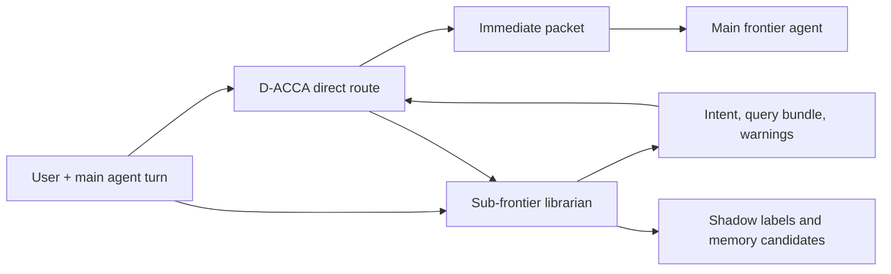

# D-ACCA Librarian Advisor Plan

Date: 2026-05-12

## Core Idea

D-ACCA should remain the library infrastructure: catalog, authority hierarchy, freshness, safety labels, route proofs, and packet assembly. A sub-frontier model should act as the librarian: optional for normal self-serve lookups, valuable for special cases where intent is vague, evidence is contradictory, the user asks for current/latest facts, or the agent is about to write durable memory.

The librarian is advisory only. It can propose better queries, negative constraints, side investigations, and verifier questions. It cannot directly admit evidence into a frontier packet. D-ACCA remains the admission authority.



## Latency Policy

Use three operating modes.

| mode | when | latency posture |
|---|---|---|
| `hot_path` | clear direct lookup | do deterministic D-ACCA only |
| `parallel_advisory` | useful but not risky | start librarian in background; merge only if ready |
| `blocking_escalation` | wrong context is costly | wait for librarian advice before final packet |

Blocking should be rare. Trigger it for latest/current questions, stale/current conflicts, safety/private evidence, low router margin, memory writes, and no-anchor queries with weak lexical overlap.

## Librarian Responsibilities

The first production librarian should have four roles.

| role | output |
|---|---|
| Intent compiler | Structured task intent, evidence needs, and query bundle |
| Abstention critic | Warnings that answerability is unsupported or external-current |
| Contradiction scout | Candidate stale/current and authority conflicts to inspect |
| Answer verifier | Claims from the final answer that lack packet/proof support |

The first deployed harness focuses on the intent compiler and abstention critic because those map directly to the known CP26/CP27 failure pattern.

## Harness Architecture

The harness added in `scripts/run_librarian_advisor_harness.py` compares two routes for each case.

1. Direct D-ACCA route on the original query.
2. Librarian-advised route bundle, where each proposed librarian query is routed by D-ACCA and only D-ACCA-admitted evidence may enter the selected union.

The harness records:

- direct selected IDs and score;
- librarian advice payload;
- per-query librarian route results;
- librarian selected union;
- required/forbidden hits;
- compactness;
- direct versus librarian latency;
- helped and harmed cases;
- route proof and frontier packet artifacts;
- deterministic intent-guard rejections.

The fixture strategy simulates a sub-frontier librarian without model latency so the architecture is testable. The rule strategy is a deterministic baseline that uses simple risk markers such as latest/current, price, GA, safety, stale, and conflict. The `model-opencode-go` strategy calls a local OpenCode Go Responses proxy, currently pointed at `deepseek-v4-flash`, and requires the model to emit the same JSON advice schema as the fixture/rule paths. If the proxy or JSON parse fails, the harness defaults to the rule librarian unless `--model-fallback error` is set.

The harness also applies a deterministic intent guard when the librarian emits `entity_terms`. This prevents widened librarian queries from crossing entities, for example selecting Recall Cloud pricing for a Nebula Cloud pricing question. The librarian can propose the entity, but the guard is deterministic and rejects selected evidence whose id, tags, provenance, or text do not match the intended entity.

## Run Commands

```powershell
cd C:\ivy\MoME-MoCE-Exp
python scripts\run_librarian_advisor_harness.py `
  --cases eval\librarian_harness_cases.json `
  --strategy fixture `
  --candidate-backend indexed `
  --out out\librarian_advisor_harness
```

Run the deterministic rule baseline:

```powershell
cd C:\ivy\MoME-MoCE-Exp
python scripts\run_librarian_advisor_harness.py `
  --cases eval\librarian_harness_cases.json `
  --strategy rule `
  --candidate-backend indexed `
  --out out\librarian_advisor_rule
```

Run the distilled deterministic DeepSeek-style librarian:

```powershell
cd C:\ivy\MoME-MoCE-Exp
python scripts\run_librarian_advisor_harness.py `
  --cases eval\librarian_harness_cases.json `
  --strategy dd-rule `
  --candidate-backend indexed `
  --out out\librarian_advisor_dd_rule_verify
```

Run the speculative deterministic draft librarian:

```powershell
cd C:\ivy\MoME-MoCE-Exp
python scripts\run_librarian_advisor_harness.py `
  --cases eval\librarian_harness_cases.json `
  --strategy spec-dd `
  --candidate-backend indexed `
  --out out\librarian_advisor_spec_dd_verify
```

Run repeated deterministic strategy comparisons:

```powershell
cd C:\ivy\MoME-MoCE-Exp
python scripts\run_librarian_strategy_matrix.py `
  --cases eval\librarian_harness_cases.json `
  --strategies rule dd-rule spec-dd spec-dd-lazy `
  --repeats 5 `
  --candidate-backend indexed `
  --out out\librarian_strategy_matrix
```

Run the DeepSeek Flash librarian through OpenCode Go:

```powershell
cd C:\ivy\MoME-MoCE-Exp
python scripts\run_librarian_advisor_harness.py `
  --cases eval\librarian_harness_cases.json `
  --strategy model-opencode-go `
  --model deepseek-v4-flash `
  --start-proxy `
  --candidate-backend indexed `
  --out out\librarian_advisor_deepseek_flash
```

For strict live-model validation, add `--model-fallback error`. Without that flag, failed or malformed model advice is recorded as `model-opencode-go:<model>:fallback_rule` so the D-ACCA evaluation can still complete. DeepSeek Flash may spend hidden output tokens before emitting visible JSON, so the harness defaults to `--model-max-output-tokens 3000` and one compact retry. Forced tool choice is available with `--model-tool-call`, but DeepSeek Flash currently rejects forced tool-choice requests through this proxy, so plain strict JSON is the default.

Outputs:

- `librarian_harness_results.json`
- `librarian_harness_summary.json`
- `librarian_harness_report.md`
- `routing_artifacts/route_proofs/*.json`
- `routing_artifacts/frontier_packets/*.json`

## Deployment Path

1. Keep the fixture and rule harness as regression tests.
2. Keep the model-backed librarian adapter schema-compatible with fixture/rule advice.
3. Run the model-backed librarian only in `parallel_advisory` or `blocking_escalation`.
4. Require D-ACCA to reroute every librarian query; never accept direct model-selected evidence.
5. Add shadow labels from real Codex/OpenCode sessions to measure whether librarian advice predicts manual evidence use.
6. Add answer verifier mode after field packets are stable.

## Success Criteria

The librarian is worth using only if it improves hard cases without damaging the fast path.

Minimum gates:

- no increase in forbidden hits;
- no increase in harmed cases;
- higher quality on vague, stale/current, safety, and abstention cases;
- hot-path direct routing remains available without model latency;
- blocking escalations stay limited to high-risk turns;
- route proofs remain schema-valid for every admitted packet.

## DeepSeek Flash Live Harness Result

Run:

```powershell
cd C:\ivy\MoME-MoCE-Exp
python scripts\run_librarian_advisor_harness.py `
  --cases eval\librarian_harness_cases.json `
  --strategy model-opencode-go `
  --model deepseek-v4-flash `
  --model-fallback error `
  --model-timeout-seconds 180 `
  --candidate-backend indexed `
  --out out\librarian_advisor_deepseek_flash_strict
```

Result after adding catalog-query sanitization and entity-term normalization:

| metric | value |
|---|---:|
| cases | 5 |
| direct quality | 0.6000 |
| DeepSeek librarian quality | 1.0000 |
| helped cases | 2 |
| harmed cases | 0 |
| forbidden hits | 0 |
| blocking escalations | 5 |
| direct mean latency | 0.448 ms |
| librarian mean latency | 49,875.050 ms |

Interpretation: DeepSeek Flash is useful as a correctness/intent-shadow librarian in hard cases, but it is far too slow for the hot path. The deployable shape is deterministic D-ACCA first, optional DeepSeek librarian in background or rare blocking escalation, with deterministic query sanitization and intent guards always applied after model advice.

## DD-Rule And Spec-DD

DeepSeek's useful contribution was mostly canonical vocabulary: vague user language like "hosted sync thing now" became `Recall Cloud pricing current`, and "cache footgun" became the exact hot-session static-prefix/cache rule. `dd-rule` distills that behavior into deterministic catalog-aware rules.

`spec-dd` is the speculative decoding/MTP-inspired variant. The analogy:

| LLM inference idea | DD-ACCA analogue |
|---|---|
| draft model proposes candidate next tokens | deterministic sidecar drafts candidate librarian query heads |
| target model verifies draft tokens | D-ACCA verifier routes each draft query and accepts only admissible evidence-bearing heads |
| MTP predicts multiple future tokens with multiple heads | sidecar emits entity, pricing, release, safety, cache, and corpus-phrase heads in one deterministic pass |
| accepted prefix moves forward | accepted query heads become the final librarian bundle |

Verification results:

| strategy | quality | helped | harmed | forbidden | mean latency |
|---|---:|---:|---:|---:|---:|
| direct D-ACCA | 0.6000 | 0 | 0 | 0 | 0.325-0.448 ms |
| rule | 0.6000 | 0 | 0 | 0 | 0.613 ms |
| dd-rule | 1.0000 | 2 | 0 | 0 | 1.444 ms |
| spec-dd | 1.0000 | 2 | 0 | 0 | 1.284 ms |
| spec-dd-lazy | 1.0000 | 2 | 0 | 0 | 0.706 ms |
| DeepSeek Flash librarian | 1.0000 | 2 | 0 | 0 | 49,875.050 ms |

Interpretation: `dd-rule` is currently the simplest hot-path candidate. `spec-dd` adds target-style verification traces and accepts the first useful draft head, so it lands in the same low-ms latency band while preserving a speculative draft/verify structure. `spec-dd-lazy` defers verification to the normal final D-ACCA bundle route and is the first sub-ms draft-librarian candidate on this harness. DeepSeek remains a shadow/teacher model, not a runtime dependency.

References used for the analogy:

- Leviathan, Kalman, and Matias, "Fast Inference from Transformers via Speculative Decoding", ICML 2023: https://proceedings.mlr.press/v202/leviathan23a
- Gloeckle et al., "Better & Faster Large Language Models via Multi-token Prediction", 2024: https://huggingface.co/papers/2404.19737
- Miao et al., "SpecInfer: Accelerating Generative LLM Serving with Speculative Inference and Token Tree Verification", 2023: https://huggingface.co/papers/2305.09781

## Open Questions

- What router-margin threshold should trigger blocking escalation?
- Should the librarian be one general model prompt or four smaller role prompts?
- How much side-track output should be persisted into shadow logs?
- Should answer verification happen before final answer emission or as post-turn critique?
- Can a cheap local model handle intent compilation well enough, or should OpenCode Go/DeepSeek Flash be used for this role?

## Session Audit 2026-05-12 17:40 IST

Objective: supercharge D-ACCA/DD-ACCA with focused deterministic librarian/router improvements and DeepSeek-backed shadow/advisory workflows.

Checklist:

| requirement | artifact/evidence | status |
|---|---|---|
| DeepSeek-backed advisory workflow | `model-opencode-go` strategy in `scripts/run_librarian_advisor_harness.py`; strict live run documented above | complete |
| deterministic quality improvement | `dd-rule` strategy distills DeepSeek canonical-query behavior | complete |
| speculative/MTP-inspired sidecar | `spec-dd` and `spec-dd-lazy` strategies draft multi-head librarian queries | complete |
| sub-ms draft-librarian candidate | nine-repeat matrix shows `spec-dd-lazy` mean `0.715 ms`, min `0.681 ms`, max `0.803 ms` | complete |
| quality/precision gate | matrix shows `1.0000` quality, `0` harmed cases, `0` forbidden hits for `dd-rule`, `spec-dd`, and `spec-dd-lazy` | complete |
| focused regression coverage | `tests/test_librarian_advisor_harness.py` covers fixture, DeepSeek parsing/fallback/guardrails, DD-rule, Spec-DD, and Spec-DD-lazy | complete |
| repeated benchmark harness | `scripts/run_librarian_strategy_matrix.py` runs repeatable strategy comparisons | complete |
| milestone commits | `bc52f61`, `c4507df`, `7ccb564`, `803d349`, `a323da8`, `212e567`, `e3f00dc` | complete |

Final matrix evidence from `out/librarian_strategy_matrix_lazy_dedup/librarian_strategy_matrix.json`:

| strategy | repeats | quality mean | harmed | forbidden | latency mean ms |
|---|---:|---:|---:|---:|---:|
| rule | 9 | 0.6000 | 0 | 0 | 0.494 |
| dd-rule | 9 | 1.0000 | 0 | 0 | 1.543 |
| spec-dd | 9 | 1.0000 | 0 | 0 | 1.334 |
| spec-dd-lazy | 9 | 1.0000 | 0 | 0 | 0.715 |

Conclusion: DeepSeek is valuable as a teacher/shadow librarian, not a hot-path runtime dependency. `spec-dd-lazy` is the best current hot-path candidate: it preserves the speculative draft/target-verifier shape while keeping latency below 1 ms on this focused harness.
