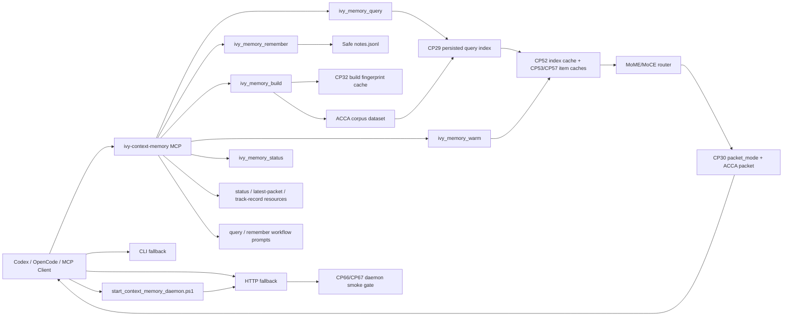

# IVY Context Memory Plugin Supercharge Track Record - 2026-05-11

## Summary

This session turned the initial `ivy-context-memory` plugin from a CLI/HTTP proof of concept into a more agent-native memory/context sidecar.

The important shift:

- before: a shellable router wrapper
- after: a tested Codex/OpenCode-facing memory plugin with MCP tools, persisted prefiltering, direct note priority, build caching, status observability, and a repeatable benchmark harness
- now: an agent-memory lifecycle with session capture, durable memory deltas, packet v2, before/after hooks, and a reproducible burn-in

## Commit Ledger

| Commit | Checkpoint | What Changed | Verification |
|---|---|---|---|
| `0272f66` | CP28 base | Created local context memory plugin, skill, CLI, HTTP API, marketplace entry, OpenCode command. | Plugin tests passed at creation time. |
| `107e382` | CP29 | Added persisted query prefilter index, generated-output ingestion skip list, in-memory prefilter routing. | `test_ivy_context_memory_plugin`, `test_cp26_cp28_contract`; smoke latency doc. |
| `699fe1e` | CP30 | Added `packet_mode`, adaptive plugin variant selection, and direct `agent_note` priority. | 7 focused tests, schema validation, CP7-CP9 and CP26-CP28 contracts. |
| `5fda75e` | CP32 | Added whole-build fingerprint cache for unchanged plugin builds. | 17 focused tests; repeated build hit measured. |
| `62d1f85` | CP33 | Implemented local MCP stdio server and `.mcp.json` registration. | MCP initialize/tools/list/status subprocess test. |
| `f656151` | CP34 | Added repeatable plugin benchmark harness. | Benchmark run hit 4/4 after fixing note-priority edge case. |
| `84ca7d3` | CP35 | Added MCP remember-then-query roundtrip test. | 19 focused tests. |
| `f61060a` | CP36 | Added build-cache status observability and OpenCode MCP docs. | 19 focused tests. |
| `dca18cc` | CP37 | Added negative no-context benchmark and fixed volatile market-price over-retrieval. | Benchmark 5/5; 19 focused tests. |
| `fe0c754` | CP38 | Added MCP resources for status, latest packet, and track record. | 20 focused tests. |
| `3459bc2` | CP39 | Added MCP workflow prompts for query-before-task and remember-after-verification. | 21 focused tests. |
| `3ccf1ba` | CP40 | Added file-level chunk cache and stricter current-price evidence gate. | Benchmark 5/5; 22 focused tests. |
| `5e3655f` | CP41 | Added rich note metadata for staleness, supersedes, and conflicts. | 17 focused tests. |
| `2a4702d` | CP42 | Added stale/current conflict lane to plugin benchmark. | Benchmark 6/6; 23 focused tests. |
| `1ca782b` | CP43 | Added stable committed plugin benchmark scoreboard. | Scoreboard 6/6; plugin tests passed. |
| `dba5a98` | CP44 | Added Codex/OpenCode memory plugin bootstrap guide. | Documentation checkpoint. |
| `098e81f` | CP45 | Added real-conversation autoresearch loop and 10M-token sharded capacity rating. | 24 focused tests; plugin benchmark 6/6. |
| `d66f34d` | CP46 | Mined hard cases from autoresearch failures and real conversation records. | 13 focused tests. |
| `af7255d` | CP47 | Evaluated mined hard cases and selected `max_prefilter_items=32`. | 14 focused tests; mined eval 5/5. |
| `c987669` | CP48 | Added deterministic reranker feature profiles. | 15 focused tests; profile eval 5/5. |
| `49fc812` | CP49 | Added guarded policy promotion for feature-profile winners. | 16 focused tests; policy promotion validated. |
| `ff021ba` | CP50 | Added combined context-memory regression gate. | 18 focused tests; gate passed. |
| `2362997` | CP51 | Lowered no-policy default prefilter budget from 192 to 32. | Full plugin router latency dropped from about 11.3 ms to 2.5 ms. |
| `3419774` | CP52 | Added in-process query-index cache. | Plugin query wall dropped from about 64 ms to 30 ms in probe. |
| `7b4c380` | CP53 | Added converted `CorpusItem` cache. | Plugin query wall improved to about 28 ms in probe. |
| `0bc03b6` | CP54 | Updated autoresearch and plugin track record docs through CP53. | Documentation checkpoint. |
| `2598fb6` | CP55 | Added wall-time checks to the regression gate. | 19 focused tests; gate passed. |
| `8363efc` | CP56 | Added plugin timing breakdown instrumentation and benchmark aggregation. | 19 focused tests; prefilter identified as dominant wall cost. |
| `ec81cf4` | CP57 | Cached prefilter feature metadata. | Plugin wall dropped to about 18.5 ms in probe; gate passed. |
| `40f355d` | CP58 | Tightened default wall budgets. | Gate passed with `35 ms` mined/feature and `25 ms` plugin wall budgets. |
| `33633a3` | CP59 | Refreshed committed plugin benchmark scoreboard. | Scoreboard 6/6, avg query wall `15.535 ms`. |
| `0bccc3c` | CP60 | Added hot repeated-query benchmark. | 21 focused tests; repeated hot wall around `7.5-7.7 ms`. |
| `d59cf2e` | CP61 | Updated hot-path track records. | Documentation checkpoint. |
| `d816b81` | CP62 | Added CLI/HTTP/MCP cache warmup command. | 22 focused tests; warmup loaded index/features/items. |
| `15c2947` | CP63 | Added MCP stdio warmup contract test. | 23 focused tests. |
| `561ba88` | CP64 | Exposed process-local cache counts in status. | 23 focused tests; MCP warm status verifies cache counts. |
| `50b9957` | CP65 | Updated warmup track records. | Documentation checkpoint. |
| `d4b21ae` | CP66 | Added persistent HTTP daemon smoke test. | 25 focused tests; post-warm query wall `8.5 ms`. |
| `90d3e32` | CP67 | Added daemon latency/cache checks. | 26 focused tests; daemon gate passed under `15 ms` wall and `5 ms` router budgets. |
| `e054f87` | CP68 | Avoided repeated source-file reads during ingest line offsets. | 27 focused tests; daemon gate passed. |
| `ffaeb6c` | CP69 | Updated daemon gate track records. | Documentation checkpoint. |
| `5c726be` | CP70 | Added PowerShell context-memory daemon bootstrap. | Parser check; bootstrap started, warmed, reported cache counts, then stopped. |
| `6e5fc7e` | CP71 | Documented daemon warm bootstrap in plugin README and skill. | 16 focused tests. |
| `2c28e86` | CP72 | Added bootstrap script contract tests. | 29 focused tests. |
| `c9797c1` | CP83-CP92 | Added agent session capture, session ingest, memory deltas, packet v2, lifecycle hooks, daemon/MCP surfaces, router candidate cap, docs, and burn-in. | 21 focused tests; CP92 burn-in; daemon smoke passed with router `4.406 ms`; combined regression gate passed. |
| `this commit` | CP93-CP102 | Added adapter lifecycle, answer-quality A/B, batch ingest, freshness scan, long-session drill, readiness doctor, and refreshed usage docs. | 28 focused tests; adapter `ok`; answer A/B packet memory `3/3` vs no-memory `0/3`; daemon router `4.638 ms`; regression gate passed. |

## Latest Benchmark

Command:

```powershell
python MoME-MoCE-Exp\scripts\run_context_memory_plugin_benchmark.py --reset
```

Latest result:

- Query count: `6`
- Passed expectations: `6 / 6`
- Avg query wall: `15.535 ms` in CP59 scoreboard
- Avg router latency: `2.478 ms` in CP59 scoreboard
- Combined regression gate plugin wall: `16.544 ms`
- Hot repeated plugin wall: `~7.5-7.7 ms`
- Warmup surfaces: CLI `warm`, HTTP `POST /warm`, MCP `ivy_memory_warm`
- Cache visibility: `status.process_caches`
- Daemon gate: post-warm query wall `10.487 ms`, router `3.236 ms`
- Daemon bootstrap: `MoME-MoCE-Exp/scripts/start_context_memory_daemon.ps1`

| Query Type | Expected Behavior | Result |
|---|---|---|
| CP28 final-answer memory | select direct note | passed |
| CP33 MCP tools memory | select direct note | passed |
| CP29 generated-output ingestion | select CP29 note | passed |
| CP32 build cache | select CP32 note | passed |
| CP42 stale/current conflict | select conflict pair and use contradiction mode | passed |
| live Bitcoin price | select no local memory | passed |

## Bugs Caught During Supercharge

### Generated-Output Feedback Loop

The plugin initially ingested its own `out` artifacts and generated packets, inflating the smoke corpus from hundreds of items to thousands.

Fix:

- skip `.ivy-context-memory`, `out`, `packets`, `query_subset`, and other generated directories during external ingestion

### Direct Note Priority Too Weak

CP29 prefilter ranked the CP28 note first, but the router selected a generic high-authority runbook chunk.

Fix:

- add direct `agent_note` priority before generic evidence selection

### Direct Note Priority Too Broad

The first benchmark draft showed a CP33 note could answer a CP32 query because generic words such as `plugin` and `build` overlapped.

Fix:

- checkpoint-numbered queries only promote notes containing the same checkpoint number

### Live External Fact Over-Retrieval

The negative benchmark showed `What is today's Bitcoin price?` selected the benchmark script itself because that query string appeared in local source.

Fix:

- mark today/current/live market-price questions as volatile
- reject `source_code` evidence as support for current commercial facts
- require `valid_from` evidence for current price claims so docs that merely discuss the bug do not become market-price evidence

### All-Or-Nothing Rebuild Cost

CP32 avoided repeated unchanged rebuilds, but any source edit still forced full re-ingestion.

Fix:

- expose `ingest_file(...)`
- cache file chunks under `store/cache/chunks`
- on changed-source rebuilds, reuse unchanged file chunks and reprocess only changed files

### Missing Plugin-Native Conflict Authoring

Before CP41, stale/conflicting plugin notes required hand-editing corpus JSON.

Fix:

- `remember` accepts `staleness`
- `remember` accepts `supersedes`
- `remember` accepts `conflicts_with`
- CLI, HTTP, and MCP all expose the metadata

### Too-Wide Default Prefilter

The plugin benchmark store did not have an autoresearch runtime policy, so it used the old default prefilter width of `192` even though the mined eval consistently selected `32`.

Fix:

- default no-policy `max_prefilter_items` to `32`
- keep runtime policy override support
- add a combined regression gate that exposes both hot mined latency and full-plugin latency

### Repeated Query Index Decode

After CP51, router latency was good but query wall time still paid repeated disk and JSON decode cost.

Fix:

- cache decoded query indexes by path, `mtime_ns`, and size
- cache converted `CorpusItem` objects by id/source-hash/text length

### Prefilter Feature Recompute

CP56 showed prefilter scoring was the dominant wall-time stage because repeated queries rebuilt per-item feature metadata.

Fix:

- add per-item feature cache for tags, checkpoint ids, and source family
- tighten regression wall budgets after the new latency profile is stable
- add a hot repeated-query benchmark that captures long-running sidecar behavior

### Invisible Warm State

CP62 added warmup, but a client also needs to know whether the persistent process is actually warmed.

Fix:

- expose `ivy_memory_warm` through MCP
- test warmup through MCP stdio subprocess
- include process-local cache counts in `status`

### Daemon Path Ungated

The plugin could pass CLI and in-process tests while the actual persistent HTTP sidecar path remained untested.

Fix:

- add daemon smoke that starts `serve`, waits for `/health`, ingests, warms, checks status, queries, and terminates
- add daemon latency gates for post-warm query wall and router latency

### Repeated Ingest File Reads

Line-offset provenance calculation reread source files per generated chunk.

Fix:

- pass the already-read source text into `item_from_chunk(...)`
- preserve line-number provenance while removing repeated file reads

### Bootstrap Drift Risk

The operational daemon path now depends on a PowerShell bootstrap script.

Fix:

- document the bootstrap in plugin README and skill instructions
- add a parser/contract test that checks `/warm`, `-StopAfterWarm`, and `process_caches`

### IVY-Only Benchmark Risk

The router needed a repeatable guard showing that strong results were not only internal IVY-doc overfit.

Fix:

- add CP74 `scripts/run_external_generalization_gate.py`
- regenerate and evaluate the external Signal/Recall corpus on demand
- require `9/9` pass, perfect required recall, perfect required-only precision, zero forbidden hits, and latency budgets
- latest CP74 run: mean `0.406 ms`, p95 `0.648 ms`, max `0.740 ms`

### External Guard Drift Risk

A side report can go stale if the default regression gate does not run it.

Fix:

- wire the CP74 external gate into `scripts/run_context_memory_regression_gate.py`
- make it default-on with `--skip-external-generalization` only for narrow debugging
- latest combined gate: external `9/9`, required precision `1.0`, forbidden hits `0`, mean `0.442 ms`, p95 `0.708 ms`

### Exact Anchor Triviality Risk

The external gate could still be too easy if it only succeeds through `exact_anchor_memory`.

Fix:

- rerun the external Signal/Recall pack with `exact_anchor_memory` disabled
- make the no-exact-anchor ablation default-on in the external gate
- latest combined gate: no-exact-anchor `9/9`, mean `0.383 ms`, p95 `0.501 ms`

### Query Wording Overfit Risk

Even without exact-anchor memory, copied query wording can make a benchmark too comfortable.

Fix:

- add a semantic-paraphrase ablation to the external gate
- preserve required/forbidden labels while changing query wording
- latest combined gate: paraphrase `9/9`, required precision `1.0`, forbidden hits `0`, mean `0.497 ms`, p95 `0.813 ms`

### Combined Ablation Risk

Separate ablations can hide interaction effects.

Fix:

- add a semantic-paraphrase plus no-exact-anchor ablation
- make it default-on in the external gate
- latest combined gate: semantic+no-exact `9/9`, required precision `1.0`, forbidden hits `0`, mean `0.416 ms`, p95 `0.597 ms`

### Adjacent Unsupported Fact Risk

Related product evidence can tempt the router into answering current facts it does not actually know.

Initial finding:

- negative controls passed only `1/5`
- Signal Android release version, Signal hosted SLA, Recall iOS ship date, and Recall SOC 2 certification over-retrieved adjacent identity notes

Fix:

- broaden unsupported-current/commercial-fact detection
- require explicit authoritative evidence for release versions, app-store status, hosted SLAs, ship dates, and certifications
- latest combined gate: negative controls `5/5`, avg selected `0.0`, p95 `0.674 ms`

### Required-Source Causality Risk

If removing the required source still produces a plausible packet, the label is not causal enough.

Initial finding:

- source-removal sensitivity initially abstained only `1/8`
- adjacent Signal/Recall identity or context notes filled in for missing required sources

Fix:

- add query-specific support checks for external subclaims
- require exact subclaim evidence for iOS delivery, cloud/Codex identity, event-log source-of-truth, daemon shell boundaries, screenshot-free structured context, text graph, Graph IR, and second-brain features
- latest combined gate: source-removal `8/8`, avg selected `0.0`, p95 `0.539 ms`

### Paraphrased Required-Source Causality Risk

Source-removal should also hold when the query wording changes.

Initial finding:

- semantic source-removal initially passed `7/8`
- the text-graph paraphrase selected Graph IR when the text-graph source was removed

Fix:

- broaden text-graph specificity to cover compact graph representation and visible board structure wording
- keep the support requirement tied to nodes, edges, groups, annotations, or unresolved relationships
- latest combined gate: semantic source-removal `8/8`, avg selected `0.0`, p95 `0.623 ms`

### External Gate Diagnostic Risk

The combined regression gate should expose which external sub-surface failed, not only that the external gate failed.

Fix:

- import all detailed external gate checks into the combined gate status with an `external_` prefix
- assert in tests that a failing external source-removal subcheck fails the combined gate

## Architecture Snapshot



## Current Strengths

- Local-first memory store.
- Native MCP tools now exist.
- MCP resources and prompts now exist.
- Direct memories are retrievable through the same interface that stores them.
- Query hot path is now low tens of milliseconds for cold-ish plugin runs and single-digit milliseconds for repeated hot queries.
- Regression gate keeps mined/feature router latency under `5 ms`.
- Full plugin benchmark router latency is now around `2.5 ms` with a `32` prefilter budget.
- Repeated plugin query wall time is down to roughly `7.5-7.7 ms` in the hot-query benchmark.
- MCP clients can explicitly warm the process before a task and inspect cache counts through status.
- Agents can now ingest real chat/session records, derive safe memory deltas, and retrieve packet v2 through lifecycle hooks.
- Agents can now use a tested adapter loop, batch session ingest, freshness scans, and readiness doctor checks.
- HTTP daemon path is now smoke-tested with cache and latency gates.
- Windows bootstrap exists for starting, warming, and inspecting the daemon.
- External Signal/Recall generalization is now a repeatable gate, not just a one-off CP23 note.
- The combined regression gate now fails if the external guard fails.
- The external guard now also tests that exact-anchor memory is not the sole success path.
- The external guard now also tests hand-paraphrased query wording.
- The external guard now combines those two pressures in one default ablation.
- The external guard now includes near-miss negative controls that must abstain.
- The external guard now verifies required-source causality by removing required evidence.
- The external guard now verifies required-source causality under paraphrased wording.
- The combined regression gate now exposes detailed external subchecks directly.
- Repeatable benchmark catches both positive retrieval and negative over-retrieval.
- Build refresh can reuse unchanged file chunks after source edits.
- Plugin-authored notes can participate in stale/current conflict routing.
- Safety still rejects obvious secret-like remembered notes.
- Autoresearch now mines hard cases, evaluates deterministic feature profiles, and can promote a winning policy under guard.

## Current Weaknesses

- Chunk cache is file-level, not section-level or semantic-delta-level.
- Section-level cache is still not implemented; CP68 only removed repeated line-offset file reads.
- MCP server now covers the main memory lifecycle, but packaging/authentication/installer polish are still minimal compared with a full production MCP package.
- Ranking is still mostly sparse/token-based with policy gates; no learned reranker.
- Benchmark set is useful but small; CP74 helps with non-IVY coverage but is still only one external product pair.
- Section-level cache is still future work; current bootstrap makes the hot daemon path easy but does not change ingest granularity.
- Signal pings failed this session because the local Signal daemon needs a real VAPID subject configured.

## Next High-Leverage Work

1. Turn the adapter into a real Codex/OpenCode install shim instead of a simulated lifecycle script.
2. Add section-level chunk cache for large Markdown files.
3. Add a daemon watcher that calls freshness scan and rebuilds on a debounce.
4. Expand answer-quality A/B from synthetic adapter cases to real coding task transcripts.
5. Expand mined hard cases beyond IVY docs with external project corpora.
6. Add an optional learned/advisory reranker only behind the deterministic gate.
