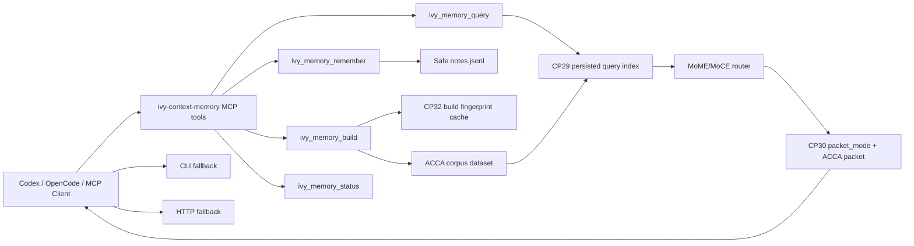

# IVY Context Memory Plugin Supercharge Track Record - 2026-05-11

## Summary

This session turned the initial `ivy-context-memory` plugin from a CLI/HTTP proof of concept into a more agent-native memory/context sidecar.

The important shift:

- before: a shellable router wrapper
- after: a tested Codex/OpenCode-facing memory plugin with MCP tools, persisted prefiltering, direct note priority, build caching, status observability, and a repeatable benchmark harness

## Commit Ledger

| Commit | Checkpoint | What Changed | Verification |
|---|---|---|---|
| `0272f66` | CP28 base | Created local context memory plugin, skill, CLI, HTTP API, marketplace entry, OpenCode command. | Plugin tests passed at creation time. |
| `107e382` | CP29 | Added persisted query prefilter index, generated-output ingestion skip list, in-memory prefilter routing. | `test_ivy_context_memory_plugin`, `test_cp26_cp28_contract`; smoke latency doc. |
| `699fe1e` | CP30 | Added `packet_mode`, adaptive plugin variant selection, and direct `agent_note` priority. | 7 focused tests, schema validation, CP7-CP9 and CP26-CP28 contracts. |
| `5fda75e` | CP32 | Added whole-build fingerprint cache for unchanged plugin builds. | 17 focused tests; repeated build hit measured. |
| `62d1f85` | CP33 | Implemented local MCP stdio server and `.mcp.json` registration. | MCP initialize/tools/list/status subprocess test. |
| `f656151` | CP34 | Added repeatable plugin benchmark harness. | Benchmark run hit 4/4 after fixing note-priority edge case. |
| `84ca7d3` | CP35 | Added MCP remember-then-query roundtrip test. | 19 focused tests. |
| `f61060a` | CP36 | Added build-cache status observability and OpenCode MCP docs. | 19 focused tests. |
| `dca18cc` | CP37 | Added negative no-context benchmark and fixed volatile market-price over-retrieval. | Benchmark 5/5; 19 focused tests. |

## Latest Benchmark

Command:

```powershell
python MoME-MoCE-Exp\scripts\run_context_memory_plugin_benchmark.py --reset
```

Latest result:

- Query count: `5`
- Passed expectations: `5 / 5`
- Avg query wall: `92.131 ms`
- Avg router latency: `10.728 ms`

| Query Type | Expected Behavior | Result |
|---|---|---|
| CP28 final-answer memory | select direct note | passed |
| CP33 MCP tools memory | select direct note | passed |
| CP29 generated-output ingestion | select CP29 note | passed |
| CP32 build cache | select CP32 note | passed |
| live Bitcoin price | select no local memory | passed |

## Bugs Caught During Supercharge

### Generated-Output Feedback Loop

The plugin initially ingested its own `out` artifacts and generated packets, inflating the smoke corpus from hundreds of items to thousands.

Fix:

- skip `.ivy-context-memory`, `out`, `packets`, `query_subset`, and other generated directories during external ingestion

### Direct Note Priority Too Weak

CP29 prefilter ranked the CP28 note first, but the router selected a generic high-authority runbook chunk.

Fix:

- add direct `agent_note` priority before generic evidence selection

### Direct Note Priority Too Broad

The first benchmark draft showed a CP33 note could answer a CP32 query because generic words such as `plugin` and `build` overlapped.

Fix:

- checkpoint-numbered queries only promote notes containing the same checkpoint number

### Live External Fact Over-Retrieval

The negative benchmark showed `What is today's Bitcoin price?` selected the benchmark script itself because that query string appeared in local source.

Fix:

- mark today/current/live market-price questions as volatile
- reject `source_code` evidence as support for current commercial facts

## Architecture Snapshot



## Current Strengths

- Local-first memory store.
- Native MCP tools now exist.
- Direct memories are retrievable through the same interface that stores them.
- Query hot path is now low tens of milliseconds inside the router.
- Repeatable benchmark catches both positive retrieval and negative over-retrieval.
- Safety still rejects obvious secret-like remembered notes.

## Current Weaknesses

- Build cache is whole-build fingerprinting, not per-file chunk reuse.
- MCP server exposes tools only, not resources/prompts.
- Ranking is still mostly sparse/token-based with policy gates; no learned reranker.
- Benchmark set is useful but small.
- Signal pings failed this session because the local Signal daemon needs a real VAPID subject configured.

## Next High-Leverage Work

1. Add MCP resources for latest packet, status, and docs.
2. Add file-level chunk cache to avoid reprocessing unchanged files.
3. Add a small contradiction/stale benchmark lane to the plugin benchmark.
4. Add persistent benchmark scoreboard in `docs/`.
5. Add OpenCode/Codex bootstrap docs that show MCP configuration end to end.
6. Add optional rerank stage that can consume prefilter score, note priority, authority, and volatility features.
