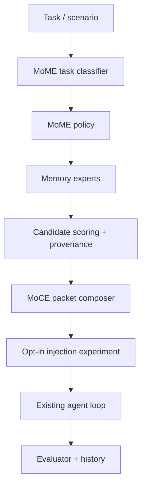
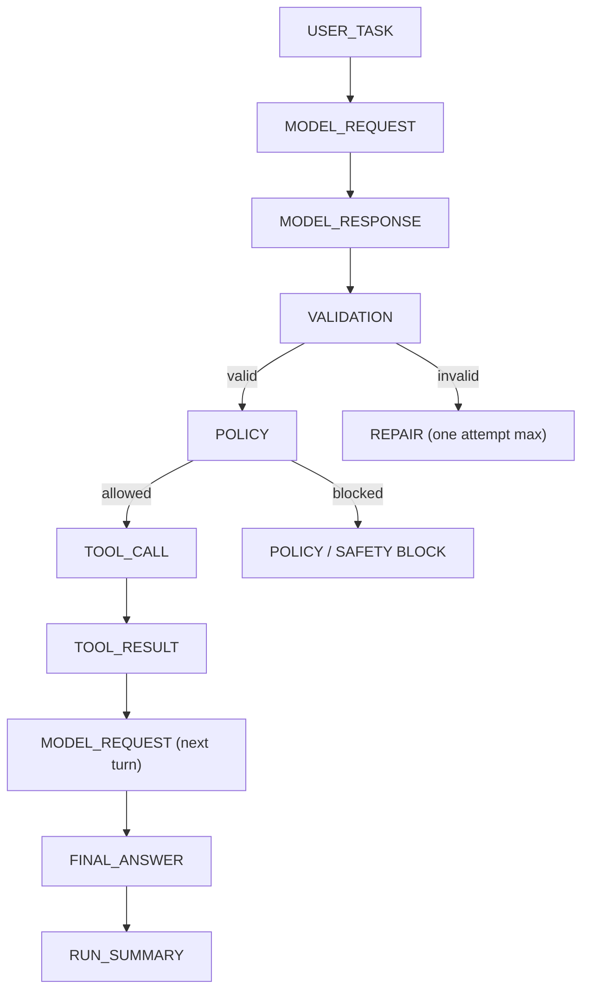

<p align="center">
  <picture>
    <source media="(prefers-color-scheme: dark)" srcset="assets/ivy-whitetext.png">
    <source media="(prefers-color-scheme: light)" srcset="assets/ivy-blacktext.png">
    
  </picture>
</p>

<h1 align="center">IVY — Local LLM Systems Lab</h1>

<p align="center">
  Making strong open LLMs usable on constrained consumer hardware through MoE placement, prompt packing, hot-session cache reuse, and tool-call reliability testing.
</p>

<p align="center">
  <strong>Status:</strong> Q4_K_M hot-session mode is the current local agent path ·
  <strong>Runtime:</strong> stock llama.cpp ·
  <strong>Hardware:</strong> RTX 4060 Laptop, 8 GB VRAM
</p>

<p align="center">
  <a href="https://github.com/arahe-dev/ivy">github.com/arahe-dev/ivy</a>
</p>

---

## Current Status

| Area | Current state |
|---|---|
| Main agent path | Qwen3.6-35B-A3B `Q4_K_M` through stock `llama.cpp` |
| Hot-session mode | long-lived server, fixed `id_slot`, `cache_prompt=true`, static prefix first |
| Practical speed | about 32 tok/s on the selected Q4_K_M stack |
| Tool safety | Phase 1.2.1 sandbox agent: **25/25** scenarios pass, **0** unsafe failures; strict JSON + policy gate (no shell/network/delete; reads sandboxed, writes only to `out/`) |
| Tool reliability (benchmark) | 25-case benchmark: 96% raw strict pass, 100% final pass with validator/retry |
| Cache reuse (agent demo) | Phase 1.1: all steps `partial_reuse` (13) vs Phase 1: all `cold_or_lost_reuse` (15); avg `prompt_ms` **6322.6 → 2854.2** (2.2x faster) |
| Passive + opt-in memory | SQLite ledger + FTS5 + deterministic hashed-vector fallback; MoME v0 experiment runner exists, no default prompt injection |
| Fast prose path | Q2/IQ2 remains useful, but is not trusted for raw tool use |
| KV eviction | Circular KV Lite is simulation/observability-only for this model |

IVY is not a new inference engine. It is a systems lab for testing how far stock local inference can go with careful runtime configuration, reproducible experiments, and honest negative results.

---

## What IVY Tests

IVY focuses on the parts that decide whether a local model is actually usable:

- MoE placement policy across CPU/GPU memory
- quantization/runtime comparisons
- prompt packing and prompt layout
- hot-session prompt/KV reuse
- strict JSON and tool-call reliability
- reproducible benchmark harnesses
- passive memory retrieval and opt-in MoME packet experiments before default prompt injection
- structured autoresearch loops

Test machine:

| Component | Value |
|---|---|
| GPU | RTX 4060 Laptop GPU |
| VRAM | 8 GB |
| RAM | about 48 GB |
| CPU | Intel i7-13650HX |
| OS | Windows |
| Runtime | stock `llama.cpp` CUDA build |

---

## Best Stack Right Now

Main agent/tool candidate:

```text
Qwen3.6-35B-A3B-UD-Q4_K_M.gguf
stock llama.cpp llama-server
reasoning off
q4 KV cache
hot-session prompt/KV reuse
```

Recommended server flags:

```powershell
--n-gpu-layers 50 `
--n-cpu-moe 32 `
--threads 14 `
--threads-batch 14 `
--flash-attn on `
--ctx-size 8192 `
--cache-type-k q4_0 `
--cache-type-v q4_0 `
--reasoning off `
--reasoning-budget 0 `
--cache-prompt
```

Recommended request pattern:

```json
{
  "id_slot": 0,
  "cache_prompt": true,
  "messages": [
    {
      "role": "user",
      "content": "<stable IVY static context>\n\nDYNAMIC TASK:\n<small changing suffix>"
    }
  ],
  "temperature": 0,
  "top_k": 1,
  "top_p": 1,
  "min_p": 0,
  "repeat_penalty": 1,
  "seed": 12345,
  "stream": false
}
```

---

## Quick Start

Run one Q4_K_M hot-session request:

```powershell
& C:\ivy\ivy\scripts\run_hot_session.ps1 `
  -ManifestPath C:\ivy\ivy\manifests\q4km_hot_agent.yaml `
  -DynamicTask "Return a concise status note for the current IVY Q4_K_M agent path." `
  -SlotId 0 `
  -OutputRunDirectory C:\ivy\ivy\runs\hot_session\example
```

The first call starts `llama-server` if the manifest port is not live. Later calls attach to the same live server and slot so the static prefix can stay hot.

Each run writes:

- `request.json`
- `response.json`
- `output.txt`
- `result.json`
- `server_command.txt`
- `hot_session_log.md`

## Memory And Evaluation Docs

The passive memory stack is documented separately from active agent runtime behavior:

- `docs/IVY_MEMORY_STATUS.md`: current passive memory architecture and checkpoint results.
- `docs/IVY_BUILD_AND_RUNBOOK.md`: copy-paste commands for memory, eval, and Qwen smoke runs.
- `docs/IVY_RESULTS_LEDGER.md`: first benchmark, ingestion, and eval results.
- `docs/IVY_NEXT_STEPS.md`: staged roadmap before MoME/MoCE.
- `docs/IVY_VERIFICATION_CHECKLIST.md`: verification commands.
- `docs/QWEN36_4060_PHASE1.md`: measurement-only Qwen 3.6 35B-A3B RTX 4060 benchmark harness.
- `docs/IVY_MEMORY_PACKET_PREVIEW.md`: Phase 2A read-only MoME/MoCE-shaped packet preview.
- `docs/IVY_MEMORY_PACKET_SWEEP.md`: Phase 2B.5 broad real packet quality sweep.
- `docs/IVY_MEMORY_COVERAGE.md`: Phase 2B.6 source-provenanced safety/docs/workflow memory coverage.
- `docs/IVY_MEMORY_RANKING.md`: source-family and exact-command ranking cleanup after docs ingestion.
- `docs/IVY_MEMORY_INJECTION_EXPERIMENT.md`: opt-in Phase 2C memory injection experiment harness.
- `docs/IVY_MOME_V0.md`: first opt-in MoME-style memory runtime and evaluation results.

Memory remains safe-by-default: SQLite is the source-of-truth ledger, FTS5 is exact retrieval, vectors are local retrieval hints, and all memory injection is opt-in through experiment/runtime flags. Normal agent runs do not receive memory packets by default.

## MoME v0 Opt-In Memory Runtime

IVY now has a first MoME-shaped memory runtime for experiments. It is system-side routing, not neural MoE: the router classifies a task, selects memory experts, scores provenance-backed candidates, asks the existing packet composer for a compact advisory packet, and injects that packet only inside the opt-in experiment harness.



MoME v0 policies:

| Policy | Intended use |
|---|---|
| `mome_none` | baseline, no memory selected |
| `mome_auto` | classifier-selected expert mix |
| `mome_debug` | JSON/tool debugging and failure memories |
| `mome_benchmark` | Qwen benchmark facts with caution wording |
| `mome_runbook` | exact runbook commands and artifact paths |
| `mome_safety` | sandbox/policy/source-code safety evidence |
| `mome_workflow` | successful workflow and tool-sequence recall |

Current packet-eval snapshot:

| Run | Term hit | Expert hit | Source-family hit | Provenance | Caution | Overclaim |
|---|---:|---:|---:|---:|---:|---:|
| `runs/mome_eval/20260429_033659_394275` | 1.00 | 1.00 | 1.00 | 1.00 | 1.00 | 0 |

Current real opt-in injection snapshot:

| Case | Baseline | Existing memory policy | MoME policy result |
|---|---|---|---|
| `calc_write_workflow` | passed, wrote `391` | `hybrid_default` passed | `mome_auto` passed |
| `benchmark_memory_question` | no unsupported numbers | `benchmark` helped | `mome_benchmark` and `mome_auto` helped with caution |
| `runbook_memory_eval` | honest no-memory answer | `hybrid_default` helped | `mome_runbook` and `mome_auto` helped |
| `json_tool_debug_think_tags` | passed with extra repair/tool step | `failure_first` improved behavior | `mome_debug`/`mome_auto` passed, not better than best existing policy in the latest run |
| `safety_path_rule` | passed | `safety_first` passed | `mome_safety` and `mome_auto` passed |

Safety boundary:

- memory is still advisory and may be incomplete or stale
- memory never bypasses the JSON validator, policy gate, or tool sandbox
- `agent_loop.py`, `validator.py`, `policy.py`, and `tools.py` remain behaviorally unchanged
- MoME memory packets are injected only by explicit experiment flags or `mome_*` policies

Useful commands:

```powershell
python -m ivy_agent_demo.mome_cli preview --query "benchmark qwen 4060 ctx 512 decode_tps" --policy mome_auto --top-k 5
python -m ivy_agent_demo.mome_eval --cases ivy_agent_demo\mome_eval_cases.json --compare-latest
python -m ivy_agent_demo.memory_injection_experiment --cases ivy_agent_demo\memory_injection_cases.json --case-id runbook_memory_eval --policies none hybrid_default mome_runbook mome_auto --compare-latest --debug
```

---

## Phase 1 Sandbox Agent UI

Phase 1 now includes a local-only tool-agent timeline UI for manually testing sandbox tasks without editing scripts.

```powershell
cd C:\ivy
powershell -ExecutionPolicy Bypass -File C:\ivy\scripts\run_phase1_ui.ps1
```

Open:

```text
http://127.0.0.1:8787
```

Safety boundary:

- binds only to `127.0.0.1`
- no shell execution
- no network
- no delete operations
- no app opening / computer-use
- reads only under `ivy_agent_demo/sandbox_workspace`
- writes only under `ivy_agent_demo/sandbox_workspace/out`

The UI renders every run as an artifact-backed timeline instead of a normal chat transcript:



Every UI run is preserved under:

```text
C:\ivy\runs\phase1_agent_demo_ui\<timestamp>
```

Relevant files:

- `ivy_agent_demo/ui_server.py`
- `ivy_agent_demo/static/index.html`
- `scripts/run_phase1_ui.ps1`
- `debug/phase1_ui_specs/`
- `docs/PHASE1_AGENT_DEMO.md`

---

## Results At A Glance

### Model Tracks


| Track | Result | Decision |
|---|---|---|
| Q2/IQ2 | roughly 50+ tok/s when tuned | Backburner for tool use; useful for fast prose/research |
| Q4_K_M | about 32 tok/s with stronger output discipline | Main local agent/tool candidate |
| MiniMax M2.7 IQ2_XXS | loads, tiny completions work, about 2 tok/s | Shelved as practical dev model; stress research only |

### Q4_K_M Optimization


The Q2 placement did not transfer cleanly to Q4_K_M. The practical Q4 path came from MoE-aware placement around `--n-cpu-moe 32`, `--n-gpu-layers 50`, flash attention, and q4 KV cache.

Selected Q4_K_M result:

| Metric | Value |
|---|---:|
| Decode speed | about 32.159 tok/s |
| Prompt timing / TTFT proxy | about 359 ms |
| Tool safety | 25-case benchmark: 96% raw strict pass, 100% final pass with validator/retry |
| Reasoning tags | No `<think>` in tested chat path |
| Markdown fences | None in tested path |

### Hot-Session Prompt/KV Reuse


Validated pattern:

- long-lived `llama-server`
- fixed `id_slot`
- `cache_prompt=true`
- stable static prefix first
- dynamic task last

Validation:

| Run | prompt_n | prompt_ms | decode_tps | Classification |
|---|---:|---:|---:|---|
| cold | 683 | 3263.614 | 31.818 | `cold_or_lost_reuse` |
| repeat same | 4 | 77.850 | 31.456 | `likely_hot_reuse` |
| changed tail | 514 | 1782.776 | 31.173 | `partial_reuse` |

Key reductions:

- Exact repeat prompt time reduction: about 97.6%
- Changed-tail prompt time reduction: about 45.4%

Decision: Q4_K_M hot-session mode is IVY's main local agent path.

---

### Tool Safety Benchmark

Q4_K_M now has a measured tool-call baseline instead of only small sanity checks. Phase 1.2.1 adds a progress guard for repeated/non-progressing tool calls and an adaptive token budget for code-writing `fs_write` tasks.

| Metric | Value |
|---|---:|
| Cases | 25 |
| Phase 1.2.1 pass rate | 25/25 |
| Unsafe failures | 0 |
| Policy violations | 0 |
| Retry count | 3 |
| Progress guard triggers | 2 |
| Cache reuse | 67 `partial_reuse`, 1 `cold_or_lost_reuse` |
| Average prompt latency | 2875.559 ms |
| Average decode speed | 14.096 tok/s |

This supports Q4_K_M as IVY's local tool agent with parser/validator/policy/progress guards, not as a model whose raw output should be executed directly.

Detailed report: [`ivy/docs/results/Q4KM_TOOL_BENCHMARK_25.md`](ivy/docs/results/Q4KM_TOOL_BENCHMARK_25.md)
Phase 1 report: [`docs/results/PHASE1_2_AGENT_DEMO_RESULTS.md`](docs/results/PHASE1_2_AGENT_DEMO_RESULTS.md)

---

## Architecture


The core rule is simple: keep the stable context first and byte-for-byte identical, then append the dynamic task. Changing metadata belongs at the end. Putting timestamps or volatile routing data before the static context destroys the prefix shape IVY is trying to reuse.

---

## Model Tracks

### Q2/IQ2

Model:

```text
C:\bread_v2\gguf\Qwen3.6-35B-A3B-UD-IQ2_XXS.gguf
```

Findings:

- Very fast when tuned with MoE-aware placement.
- Earlier best practical speed was roughly 50+ tok/s.
- Prompt Packing V7 reduced prompt tokens and TTFT.
- Not trusted for strict raw tool use because tests showed `<think>` tags, markdown fences, and JSON/tool safety problems.

Decision: backburner for agent/tool use; still useful for fast human-facing prose, chat, and research.

### Q4_K_M

Model:

```text
C:\bread_v2\gguf\Qwen3.6-35B-A3B-UD-Q4_K_M.gguf
```

Findings:

- Practical stock `llama.cpp` baseline around 32 tok/s.
- Clean reasoning-off behavior in the tested path.
- 25-case tool benchmark: 96% raw strict pass and 100% final pass with validator/retry.
- No `<think>` tags or markdown fences in the selected tested path.

Decision: main local agent/tool candidate with parser/validator/retry.

### MiniMax M2.7

Model:

```text
MiniMax-M2.7 IQ2_XXS split GGUF
```

Findings:

- Loads locally.
- Tiny completions work.
- CPU-only around 1.58 tok/s.
- GPU-assisted `--n-gpu-layers 10` around 2.19 tok/s.

Decision: shelved as a practical dev model; kept as a behemoth/stress research target.

### Circular KV Lite

Built:

- mechanics spec
- region classification
- pressure simulation
- runtime capability gate

Finding: Qwen35MoE runtime reports partial sequence removal is not supported. Real middle-window eviction is disabled for this model.

Decision: observability/simulation-only for now.

---

## What Worked

- MoE-aware placement beat naive GPU-heavy placement.
- Prompt Packing V7 reduced prompt tokens and TTFT.
- Q4_K_M with reasoning off produced cleaner tool behavior than Q2/IQ2.
- q4 KV cache preserved Q4_K_M decode speed while reducing KV memory.
- Hot-session prompt/KV reuse produced large prompt-time reductions.
- Structured autoresearch loops made negative results visible instead of hiding them.

## What Failed Or Moved To Backburner

| Item | Status | Reason |
|---|---|---|
| Q2/IQ2 as raw tool model | Backburner | Fast, but showed `<think>`, fences, and JSON/tool reliability issues |
| V7.1 prompt packing | Rejected | Overfit; fresh held-out checks failed |
| Output packing | Rejected/backburner | Quality and tooling issues |
| One-shot prefix/cache reuse | Replaced | Correct architecture is a long-lived hot server |
| MiniMax M2.7 as dev model | Shelved | Loads and runs, but about 2 tok/s locally |
| Circular KV Lite eviction | Disabled | Runtime reports partial sequence removal unsupported for this model |

---

## Repo Map

```text
ivy/
  assets/                      # README logos
  docs/                        # Current state, results, specs, figures
  docs/figures/                # GitHub-friendly visualizations
  manifests/                   # Runtime and experiment manifests
  prompts/static_prefix/       # Stable agent prefixes for hot sessions
  scripts/                     # Experiment and hot-session runners
  validation_tasks/            # Prompt/task fixtures
```

Useful docs:

- [`ivy/docs/CURRENT_STATE.md`](ivy/docs/CURRENT_STATE.md)
- [`ivy/docs/RESULTS.md`](ivy/docs/RESULTS.md)
- [`ivy/docs/HOT_SESSION_RUNNER.md`](ivy/docs/HOT_SESSION_RUNNER.md)
- [`ivy/docs/TOOL_SAFETY.md`](ivy/docs/TOOL_SAFETY.md)
- [`ivy/docs/results/Q4KM_TOOL_BENCHMARK_25.md`](ivy/docs/results/Q4KM_TOOL_BENCHMARK_25.md)

---

## Roadmap

1. Expand Q4_K_M tool testing from 25 cases to a larger adversarial suite.
2. Add optional slot save/restore or session persistence experiment.
3. Build execution gating around validator verdicts and human-confirmation requirements.
4. Keep Q2/IQ2 available as a fast prose/research lane, not the default tool lane.
5. Expand reports so every run produces pass/warn/fail recommendations.

---

## Caveats

- These are single-machine measurements on a Windows laptop with an RTX 4060 Laptop GPU.
- Results depend on this `llama.cpp` build and the listed GGUF files.
- IVY does not modify `llama.cpp` or model files.
- Hot-session reuse is a performance optimization, not a correctness guarantee.
- MiniMax is not practical on this hardware despite loading successfully.

---

## Summary

IVY has turned a pile of local model experiments into a reproducible systems workflow: benchmark model tracks, tune MoE placement, measure prompt packing, validate output safety, and exploit hot prompt/KV reuse. The current best local agent path is Qwen3.6-35B-A3B Q4_K_M through stock `llama.cpp` with a fixed-slot hot-session runner.
