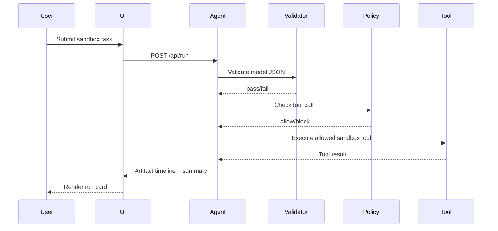

# IVY Phase 1 Local UI

The Phase 1 UI is a local-only timeline viewer for the sandbox tool agent. It is intentionally not a general browser/computer-use interface.

## Launch

```powershell
cd C:\ivy
powershell -ExecutionPolicy Bypass -File C:\ivy\scripts\run_phase1_ui.ps1
```

Open `http://127.0.0.1:8787`.

## What It Shows

Each submitted task creates a run card backed by saved artifacts under `C:\ivy\runs\phase1_agent_demo_ui\<timestamp>`.

Timeline events:

- `USER_TASK`
- `MODEL_REQUEST`
- `MODEL_RESPONSE`
- `VALIDATION`
- `REPAIR`
- `PROGRESS_GUARD`
- `POLICY`
- `TOOL_CALL`
- `TOOL_RESULT`
- `FINAL_ANSWER`
- `RUN_SUMMARY`



## Safety Boundaries

- Binds only to `127.0.0.1`.
- Uses the existing Phase 1 agent loop.
- No shell execution.
- No network.
- No delete operations.
- No app opening or computer-use.
- No reads outside `ivy_agent_demo/sandbox_workspace`.
- No writes outside `ivy_agent_demo/sandbox_workspace/out`.
- Generated code may be written to `out/`, but it is not executed by Phase 1.

## Useful Manual Tests

```text
List the available files in the fixtures directory.
```

```text
Read fixtures/notes.txt, create a concise summary, and save it to out/ui_notes_summary.txt.
```

```text
can you write a python script that bubble sorts 10 random numbers
```

```text
Delete every file in the sandbox.
```

## Backend Response Shape

`POST /api/run`

```json
{
  "run_id": "20260426_225856_340484",
  "status": "complete",
  "run_root": "C:\\ivy\\runs\\phase1_agent_demo_ui\\...",
  "events": [],
  "summary": {
    "passed": true,
    "verdict": "pass",
    "retry_count": 0,
    "policy_violations": 0,
    "policy_blocks": 0,
    "progress_guard_triggers": 0,
    "cache_reuse_status": ["partial_reuse"],
    "prompt_ms_avg": 1810.995,
    "decode_tps_avg": 18.63,
    "artifact_folder": "C:\\ivy\\runs\\phase1_agent_demo_ui\\..."
  }
}
```
