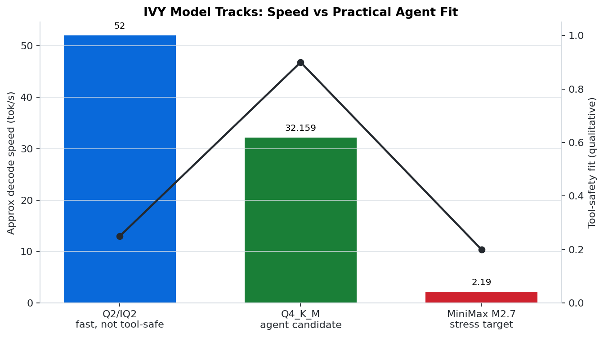
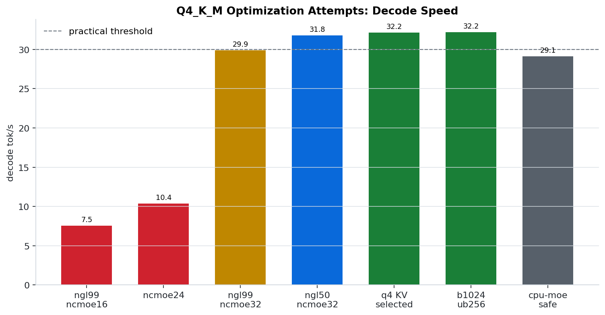
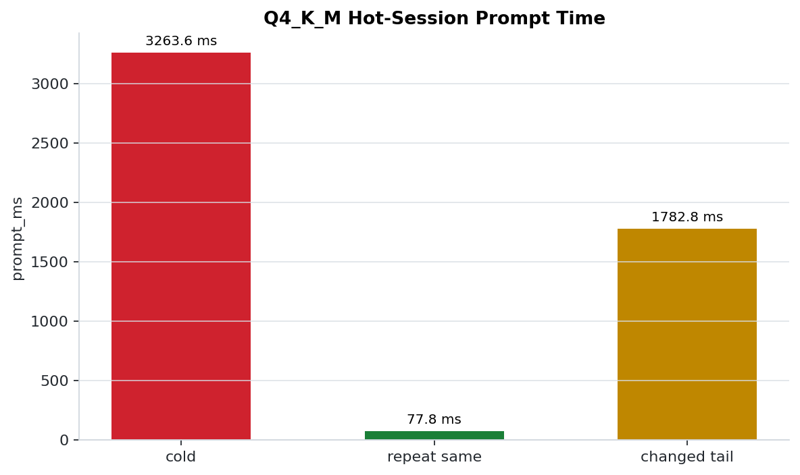
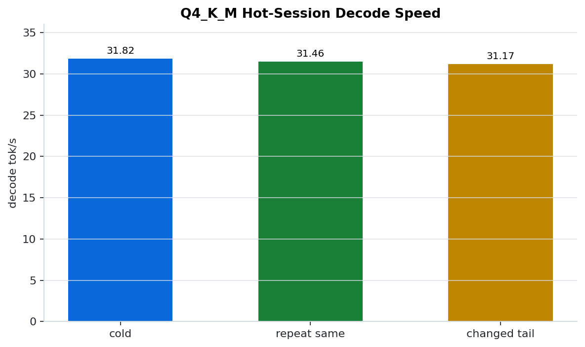
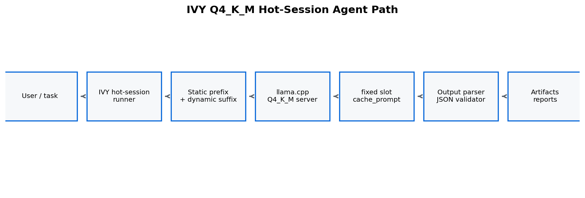

# IVY

IVY is a local LLM systems lab focused on making strong open models usable on constrained consumer hardware.

It is not a new inference engine. IVY builds reproducible harnesses, placement policies, prompt layouts, cache-reuse workflows, and tool-safety tests around stock runtimes such as `llama.cpp`.

## Current Status

| Area | Current state |
|---|---|
| Main agent path | Qwen3.6-35B-A3B `Q4_K_M` through stock `llama.cpp` |
| Hot-session strategy | long-lived server, fixed `id_slot`, `cache_prompt=true`, static prefix first |
| Practical speed | about 32 tok/s on the selected Q4_K_M stack |
| Tool safety | Q4_K_M passed bounded JSON/tool sanity checks in the tested path |
| Fast prose track | Q2/IQ2 remains useful, but is not trusted for raw tool use |
| KV eviction | Circular KV Lite is simulation/observability-only for this model |

## Hardware

The current results were produced on:

- RTX 4060 Laptop GPU, 8 GB VRAM
- about 48 GB RAM
- Intel i7-13650HX
- Windows
- stock `llama.cpp` CUDA build

## Best Local Agent Stack

Main agent/tool candidate:

```text
Qwen3.6-35B-A3B-UD-Q4_K_M.gguf
stock llama.cpp llama-server
reasoning off
q4 KV cache
hot-session prompt/KV reuse
```

Server path:

```text
C:\Users\arahe\dev\llama.cpp\build\bin\Release\llama-server.exe
```

Model path:

```text
C:\bread_v2\gguf\Qwen3.6-35B-A3B-UD-Q4_K_M.gguf
```

Recommended flags:

```powershell
--n-gpu-layers 50 `
--n-cpu-moe 32 `
--threads 14 `
--threads-batch 14 `
--flash-attn on `
--ctx-size 8192 `
--cache-type-k q4_0 `
--cache-type-v q4_0 `
--reasoning off `
--reasoning-budget 0 `
--cache-prompt
```

Request pattern:

- fixed `id_slot`
- `cache_prompt=true`
- stable IVY static context first
- dynamic task suffix last
- deterministic decoding for tool-call turns

## Quick Start

Run a Q4_K_M hot-session request:

```powershell
& C:\ivy\ivy\scripts\run_hot_session.ps1 `
  -ManifestPath C:\ivy\ivy\manifests\q4km_hot_agent.yaml `
  -DynamicTask "Return a concise status note for the current IVY Q4_K_M agent path." `
  -SlotId 0 `
  -OutputRunDirectory C:\ivy\ivy\runs\hot_session\example
```

The first call starts `llama-server` if needed. Later calls attach to the same port and slot so the stable prefix can stay hot.

Each run writes:

- `request.json`
- `response.json`
- `output.txt`
- `result.json`
- `server_command.txt`
- `hot_session_log.md`

## Results

### Model Tracks



| Track | Result | Decision |
|---|---|---|
| Q2/IQ2 | roughly 50+ tok/s when tuned | Backburner for tool use; useful for fast prose/research |
| Q4_K_M | about 32 tok/s with stronger output discipline | Main local agent/tool candidate |
| MiniMax M2.7 IQ2_XXS | loads, tiny completions work, about 2 tok/s | Shelved as practical dev model; stress research only |

### Q4_K_M Optimization



The Q2 placement did not transfer cleanly to Q4_K_M. The practical Q4 path emerged from MoE-aware placement around `--n-cpu-moe 32`, `--n-gpu-layers 50`, flash attention, and q4 KV cache.

Selected Q4_K_M stock `llama.cpp` result:

| Metric | Value |
|---|---:|
| Decode speed | about 32.159 tok/s |
| Prompt timing / TTFT proxy | about 359 ms |
| Tool sanity | Passed bounded JSON/tool checks |
| Reasoning tags | No `<think>` in tested chat path |
| Markdown fences | None in tested path |

### Hot-Session Prompt/KV Reuse





Validated pattern:

- long-lived `llama-server`
- fixed `id_slot`
- `cache_prompt=true`
- static prefix first
- dynamic task last

Validation:

| Run | prompt_n | prompt_ms | decode_tps | Classification |
|---|---:|---:|---:|---|
| cold | 683 | 3263.614 | 31.818 | `cold_or_lost_reuse` |
| repeat same | 4 | 77.850 | 31.456 | `likely_hot_reuse` |
| changed tail | 514 | 1782.776 | 31.173 | `partial_reuse` |

Key reductions:

- Exact repeat prompt time reduction: about 97.6%
- Changed-tail prompt time reduction: about 45.4%

Decision: Q4_K_M hot-session mode is IVY's main local agent path.

## Architecture



The important design constraint is prefix stability. Changing metadata belongs at the end, after the static prefix. Putting timestamps or dynamic routing data before the static context destroys the cache shape IVY is trying to reuse.

## What Worked

- MoE-aware placement beat naive GPU-heavy placement.
- Prompt Packing V7 reduced prompt tokens and TTFT in the Q2/IQ2 line.
- Q4_K_M with reasoning off gave cleaner tool behavior than Q2/IQ2.
- q4 KV cache preserved Q4_K_M decode speed while reducing KV memory.
- Hot-session prompt/KV reuse produced large prompt-time reductions.
- Structured autoresearch loops made negative results visible instead of burying them.

## What Failed Or Moved To Backburner

| Item | Status | Reason |
|---|---|---|
| Q2/IQ2 as raw tool model | Backburner | Fast, but showed `<think>`, fences, and JSON/tool reliability issues |
| V7.1 prompt packing | Rejected | Overfit; fresh held-out checks failed |
| Output packing | Rejected/backburner | Quality and tooling issues |
| One-shot prefix/cache reuse | Replaced | Correct architecture is a long-lived hot server |
| MiniMax M2.7 as dev model | Shelved | Loads and runs, but about 2 tok/s locally |
| Circular KV Lite eviction | Disabled | Runtime reports partial sequence removal unsupported for this Qwen35MoE model |

## Repo Structure

```text
ivy/
  assets/                      # README logos
  docs/                        # Current state, results, specs, figures
  docs/figures/                # GitHub-friendly result visualizations
  manifests/                   # Runtime and experiment manifests
  prompts/static_prefix/       # Stable agent prefixes for hot sessions
  scripts/                     # Experiment and hot-session runners
  validation_tasks/            # Prompt/task fixtures
```

## Roadmap

1. Add parser/validator/retry layer around Q4_K_M hot-session outputs.
2. Run a 25-case Q4_K_M structured/tool benchmark using the hot-session runner.
3. Add optional slot save/restore or session persistence experiment.
4. Keep Q2/IQ2 available as a fast prose/research lane, not the default tool lane.
5. Expand reporting so every run produces pass/warn/fail recommendations.

## Caveats

- These are single-machine measurements on a Windows laptop with an RTX 4060 Laptop GPU.
- The results depend on this `llama.cpp` build and the listed GGUF files.
- IVY does not modify `llama.cpp` or the model files.
- Hot-session reuse is a performance optimization, not a correctness guarantee.
- MiniMax is not practical on this hardware despite loading successfully.

## Resume-Style Summary

IVY has turned a set of local LLM experiments into a reproducible systems workflow: benchmark model tracks, tune MoE placement, measure prompt packing, validate output safety, and exploit hot prompt/KV reuse. The current best local agent path is Qwen3.6-35B-A3B Q4_K_M through stock `llama.cpp` with a fixed-slot hot-session runner.
