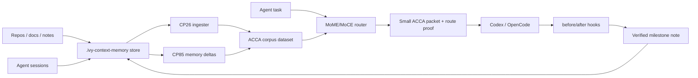

# IVY Context Memory Plugin

Local context/memory sidecar for Codex, OpenCode, and other coding agents.

The plugin does not try to put unlimited text into the prompt. It keeps the large memory outside the model, ingests repos/docs/notes into ACCA-shaped evidence, then returns a small audited context packet for the current task.



## Quick Start

Hot daemon path for Codex/OpenCode:

```powershell
cd C:\ivy
powershell -ExecutionPolicy Bypass -File .\MoME-MoCE-Exp\scripts\start_context_memory_daemon.ps1
```

This starts the localhost HTTP sidecar if needed, ingests `MoME-MoCE-Exp`, warms the query/index caches, and prints cache status. The default API URL is `http://127.0.0.1:8768`.

One-shot CLI path:

```powershell
cd C:\ivy
python .\plugins\ivy-context-memory\scripts\ivy_context_memory.py init
python .\plugins\ivy-context-memory\scripts\ivy_context_memory.py ingest --source-root C:\ivy\MoME-MoCE-Exp
python .\plugins\ivy-context-memory\scripts\ivy_context_memory.py query --query "What should I know before changing the MoME router?" --text
```

## Commands

| Command | Purpose |
|---|---|
| `init` | Create `.ivy-context-memory` store |
| `ingest --source-root PATH` | Add a repo/docs folder and rebuild the ACCA dataset |
| `build` | Rebuild from registered source roots and notes |
| `remember --text ...` | Store a short safe milestone note and rebuild; supports `--staleness`, `--supersedes`, and `--conflicts-with` |
| `session-ingest --json PATH` | Capture an agent chat/session transcript, derive memory deltas, and optionally remember them |
| `agent-hook --hook before_task --task ...` | Run an agent lifecycle hook for packet retrieval or after-task memory writing |
| `packet-v2 --query ...` | Return the agent-oriented context packet v2 wrapper |
| `query --query ...` | Return JSON with selected IDs, packet text, route proof |
| `query --query ... --text` | Return only the packet text |
| `warm` | Preload query-index, feature, and corpus-item caches in the current process |
| `serve` | Start localhost HTTP API for OpenCode or other tools |
| `mcp` | Start a local MCP stdio server |

## HTTP API

```powershell
python .\plugins\ivy-context-memory\scripts\ivy_context_memory.py serve --port 8768
```

Then:

```powershell
Invoke-RestMethod http://127.0.0.1:8768/status
Invoke-RestMethod http://127.0.0.1:8768/warm -Method Post -ContentType application/json -Body '{"queries":["What matters for CP29?"]}'
Invoke-RestMethod http://127.0.0.1:8768/query -Method Post -ContentType application/json -Body '{"query":"What matters for CP29?","variant":"auto"}'
Invoke-RestMethod http://127.0.0.1:8768/agent/hook -Method Post -ContentType application/json -Body '{"hook":"before_task","task":"What context matters for this edit?"}'
```

## MCP

The plugin now exposes local MCP tools through `.mcp.json`:

- `ivy_memory_query`
- `ivy_memory_remember`
- `ivy_memory_ingest`
- `ivy_memory_session_ingest`
- `ivy_memory_agent_hook`
- `ivy_memory_build`
- `ivy_memory_warm`
- `ivy_memory_status`

The stdio command is:

```powershell
python C:\ivy\plugins\ivy-context-memory\scripts\ivy_context_memory.py mcp
```

It also exposes MCP resources:

- `ivy-memory://status`
- `ivy-memory://latest-packet`
- `ivy-memory://track-record`

And MCP prompts:

- `query_ivy_memory_before_task`
- `remember_verified_milestone`

## Design

- Uses the existing MoME/MoCE ACCA router.
- Uses CP26 external ingestion to turn arbitrary folders into evidence.
- Uses adaptive packet rendering: compact for simple cases, proof/contradiction-aware for complex cases.
- Uses CP29 persisted prefilter indexes for query routing.
- Keeps the recall prefilter at `32` items by default, then caps final proof-router scoring at `16` candidates unless runtime policy overrides `router_candidate_k`.
- Uses CP30 packet modes and direct note priority.
- Uses CP32 build fingerprint caching for unchanged rebuilds.
- Uses process-local query-index, feature, and corpus-item caches; `warm` / `/warm` / `ivy_memory_warm` preheats them.
- Captures agent sessions into `sessions/*.json`, distills durable records into `memory_deltas.jsonl`, and remembers safe deltas as queryable evidence.
- Exposes lifecycle hooks for `before_task`, `before_edit`, `after_test`, `after_task`, `remember`, and `supersede`.
- Can consume an autoresearch runtime policy from `store/policy/autoresearch_policy.json`.
- Stores route packets under `.ivy-context-memory/packets/`.
- Keeps memory advisory; it never outranks current user/system/developer instructions or repo state.

## Current Limitations

- The MCP server exposes tools, resources, workflow prompts, session ingest, and agent hooks.
- File-level chunk caching exists, but section-level semantic-delta caching is still future work.
- Warmup is process-local; a one-shot CLI warm proves behavior but does not warm later processes.
- The note write barrier is intentionally conservative and rejects obvious secret-like text.
