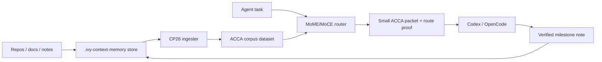

# IVY Context Memory Plugin

Local context/memory sidecar for Codex, OpenCode, and other coding agents.

The plugin does not try to put unlimited text into the prompt. It keeps the large memory outside the model, ingests repos/docs/notes into ACCA-shaped evidence, then returns a small audited context packet for the current task.



## Quick Start

```powershell
cd C:\ivy
python .\plugins\ivy-context-memory\scripts\ivy_context_memory.py init
python .\plugins\ivy-context-memory\scripts\ivy_context_memory.py ingest --source-root C:\ivy\MoME-MoCE-Exp
python .\plugins\ivy-context-memory\scripts\ivy_context_memory.py query --query "What should I know before changing the MoME router?" --text
```

## Commands

| Command | Purpose |
|---|---|
| `init` | Create `.ivy-context-memory` store |
| `ingest --source-root PATH` | Add a repo/docs folder and rebuild the ACCA dataset |
| `build` | Rebuild from registered source roots and notes |
| `remember --text ...` | Store a short safe milestone note and rebuild |
| `query --query ...` | Return JSON with selected IDs, packet text, route proof |
| `query --query ... --text` | Return only the packet text |
| `serve` | Start localhost HTTP API for OpenCode or other tools |

## HTTP API

```powershell
python .\plugins\ivy-context-memory\scripts\ivy_context_memory.py serve --port 8768
```

Then:

```powershell
Invoke-RestMethod http://127.0.0.1:8768/status
Invoke-RestMethod http://127.0.0.1:8768/query -Method Post -ContentType application/json -Body '{"query":"What matters for CP29?","variant":"auto"}'
```

## Design

- Uses the existing MoME/MoCE ACCA router.
- Uses CP26 external ingestion to turn arbitrary folders into evidence.
- Uses adaptive packet rendering: compact for simple cases, proof/contradiction-aware for complex cases.
- Stores route packets under `.ivy-context-memory/packets/`.
- Keeps memory advisory; it never outranks current user/system/developer instructions or repo state.

## Current Limitations

- The MCP entry is not implemented yet; use CLI or HTTP API.
- Rebuilds are full rebuilds, not incremental.
- Large ingested corpora are correct but slower than curated corpora; CP29 should add a two-stage or persisted index.
- The note write barrier is intentionally conservative and rejects obvious secret-like text.
